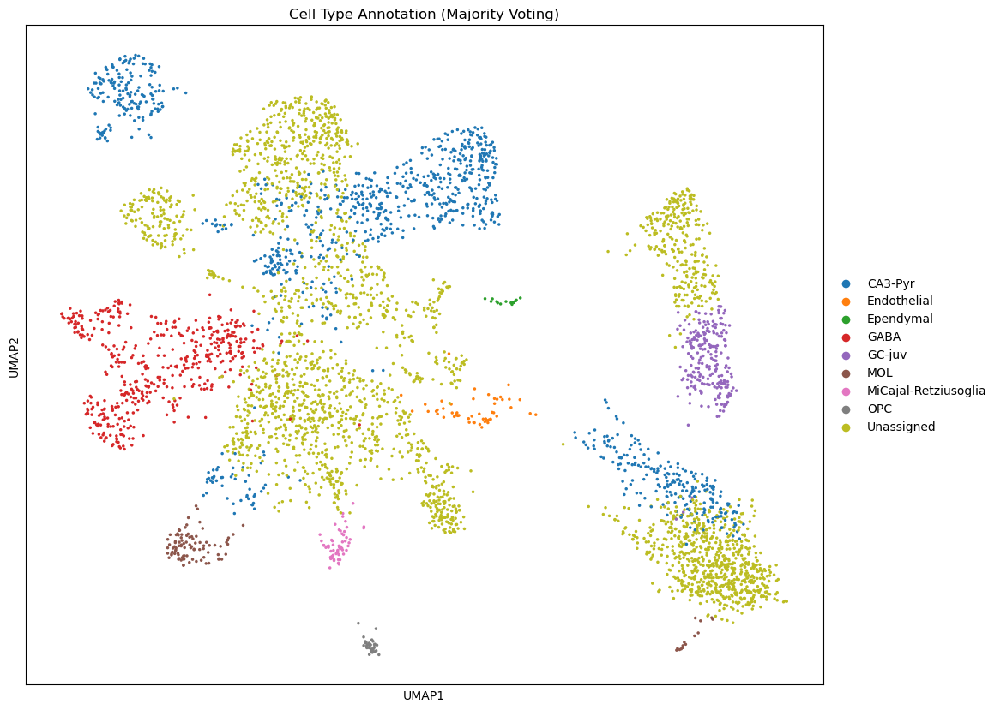
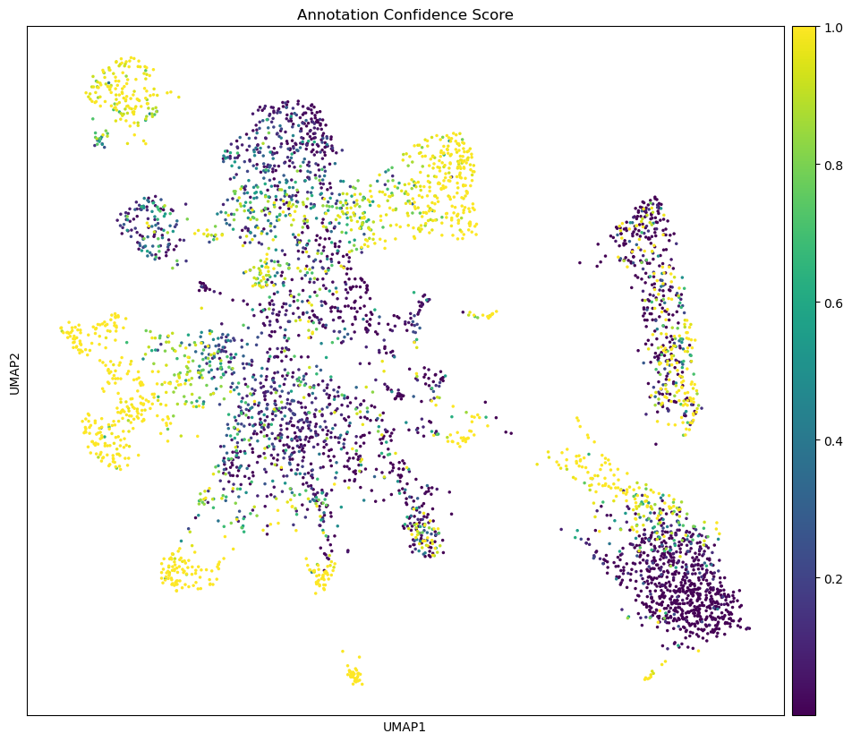

# Environment

# Load Data

    Loading AnnData from /beegfs/scratch/ric.broccoli/kubacki.michal/SRF_Linda_RNA/post_analysis/results/cellranger_counts_R26_Emx1_Ctrl_adult_0/adata.h5ad

    AnnData object contains 4707 cells and 26071 genes

# Explore cell annotation model

    <class 'celltypist.models.Model'>
    dict_keys(['classifier', 'scaler', 'description'])
    {'date': '2023-07-14 20:03:58.410321', 'details': 'cell types from the dentate gyrus in perinatal, juvenile, and adult mice', 'url': 'https://celltypist.cog.sanger.ac.uk/models/Mouse_DG_Hochgerner/v1/Mouse_Dentate_Gyrus.pkl', 'source': 'https://doi.org/10.1038/s41593-017-0056-2', 'version': 'v1', 'number_celltypes': 24}
    Model: Mouse_Dentate_Gyrus.pkl
    Number of cell types: 24

    Available attributes and methods:
      - cell_types: <class 'numpy.ndarray'>
      - classifier: <class 'sklearn.linear_model._logistic.LogisticRegression'>
      - convert: <class 'method'>
      - description: <class 'dict'>
      - extract_top_markers: <class 'method'>
      - features: <class 'numpy.ndarray'>
      - load: <class 'function'>
      - predict_labels_and_prob: <class 'method'>
      - scaler: <class 'sklearn.preprocessing._data.StandardScaler'>
      - write: <class 'method'>

    array(['Astro-adult', 'Astro-juv', 'CA3-Pyr', 'Cajal-Retzius',
           'Endothelial', 'Ependymal', 'GABA', 'GC-adult', 'GC-juv',
           'Immature-Astro', 'Immature-GABA', 'Immature-GC', 'Immature-Pyr',
           'MOL', 'MiCajal-Retziusoglia', 'NFOL', 'Neuroblast', 'OPC', 'PVM',
           'RGL', 'RGL_young', 'VLMC', 'nIPC', 'nIPC-perin'], dtype=object)

    
    Cell types:
      1. Astro-adult
      2. Astro-juv
      3. CA3-Pyr
      4. Cajal-Retzius
      5. Endothelial
      6. Ependymal
      7. GABA
      8. GC-adult
      9. GC-juv
      10. Immature-Astro
      11. Immature-GABA
      12. Immature-GC
      13. Immature-Pyr
      14. MOL
      15. MiCajal-Retziusoglia
      16. NFOL
      17. Neuroblast
      18. OPC
      19. PVM
      20. RGL
      21. RGL_young
      22. VLMC
      23. nIPC
      24. nIPC-perin

    
    Extracting markers for key cell types...
    
    Top 5 markers for Astro-adult:
      - Mt2
      - S1pr1
      - Gja1
      - Mt1
      - Gstm1
    
    Top 5 markers for Astro-juv:
      - Arxes2
      - Hmgcs1
      - Btbd17
      - Gstm5
      - 6330403K07Rik
    
    Top 5 markers for CA3-Pyr:
      - Sv2b
      - Cck
      - Rasgrp1
      - Pde1a
      - Hpca
    
    Top 5 markers for Cajal-Retzius:
      - Lhx5
      - Gm27199
      - Reln
      - Lhx1os
      - Lhx1
    
    Top 5 markers for Endothelial:
      - Slco1a4
      - Ebf1
      - Pcp4l1
      - Rgs5
      - Igfbp7
    
    Top 5 markers for Ependymal:
      - 2410004P03Rik
      - Tekt1
      - Calml4
      - Mlf1
      - Cfap126
    
    Top 5 markers for GABA:
      - Gad2
      - Erbb4
      - Gad1
      - Slc32a1
      - Impact
    
    Top 5 markers for GC-adult:
      - Slc24a5
      - Nptx1
      - Marf1
      - Gas7
      - Pam
    
    Top 5 markers for GC-juv:
      - Ubb
      - Rnf121
      - Camk2a
      - Rplp0
      - Paqr9
    
    Top 5 markers for Immature-Astro:
      - Id3
      - Ednrb
      - Igfbp2
      - Lxn
      - Ncan
    
    Top 5 markers for Immature-GABA:
      - Dlx1
      - Dlx5
      - Dlx2
      - Npas1
      - Rpp25
    
    Top 5 markers for Immature-GC:
      - Cntnap5a
      - Nrgn
      - Pcp4
      - Zbtb20
      - Lrp1b
    
    Top 5 markers for Immature-Pyr:
      - Gap43
      - Neurod6
      - Syt4
      - Opcml
      - Crym
    
    Top 5 markers for MOL:
      - Ptgds
      - Plp1
      - Tspan2
      - Ermn
      - Mobp
    
    Top 5 markers for MiCajal-Retziusoglia:
      - Cx3cr1
      - P2ry12
      - Hexb
      - Ccr5
      - Selplg
    
    Top 5 markers for NFOL:
      - Fyn
      - Bcas1
      - Bmp4
      - Enpp6
      - Gpr17
    
    Top 5 markers for Neuroblast:
      - Sox4
      - Mfap4
      - Igsf8
      - Cttnbp2
      - Nfix
    
    Top 5 markers for OPC:
      - Pdgfra
      - Lhfpl3
      - Olig1
      - Olig2
      - Ostf1
    
    Top 5 markers for PVM:
      - Pf4
      - Mrc1
      - F13a1
      - Ms4a7
      - Ctsc
    
    Top 5 markers for RGL:
      - Itih3
      - Riiad1
      - Thrsp
      - Hopxos
      - Abca8a
    
    Top 5 markers for RGL_young:
      - Ccdc80
      - Gas1
      - Fabp7
      - Gdf10
      - Dbi
    
    Top 5 markers for VLMC:
      - Col1a2
      - Dcn
      - Nupr1
      - Col1a1
      - Col3a1
    
    Top 5 markers for nIPC:
      - Insm1
      - 2810417H13Rik
      - Gadd45g
      - Hmgb2
      - Cks2
    
    Top 5 markers for nIPC-perin:
      - 2810417H13Rik
      - Emp1
      - Cenpa
      - Birc5
      - Cdca8

# Annotate data

    4.0
    0.0

    Layers with keys: for_cell_typist

    10000.001

    🔬 Input data has 4707 cells and 26071 genes

    🔗 Matching reference genes in the model

    Running CellTypist with majority_voting=True, prob_threshold=0.5

    🧬 3897 features used for prediction

    ⚖️ Scaling input data

    🖋️ Predicting labels

    ✅ Prediction done!

    👀 Can not detect a neighborhood graph, will construct one before the over-clustering

    ⛓️ Over-clustering input data with resolution set to 5

    🗳️ Majority voting the predictions

    ✅ Majority voting done!

    AnnData object with n_obs × n_vars = 4707 × 26071
        obs: 'n_genes', 'n_genes_by_counts', 'total_counts', 'total_counts_mt', 'pct_counts_mt', 'predicted_labels', 'over_clustering', 'majority_voting', 'conf_score'
        var: 'gene_ids', 'feature_types', 'n_cells', 'mt', 'n_cells_by_counts', 'mean_counts', 'pct_dropout_by_counts', 'total_counts', 'highly_variable', 'means', 'dispersions', 'dispersions_norm'
        uns: 'hvg', 'log1p', 'neighbors', 'over_clustering'
        obsm: 'X_pca'
        layers: 'for_cell_typist'
        obsp: 'connectivities', 'distances'

    AnnData object with n_obs × n_vars = 4707 × 26071
        obs: 'n_genes', 'n_genes_by_counts', 'total_counts', 'total_counts_mt', 'pct_counts_mt', 'predicted_labels', 'over_clustering', 'majority_voting', 'conf_score', 'prob_predicted_labels', 'prob_over_clustering', 'prob_majority_voting', 'prob_conf_score', 'prob_Astro-adult', 'prob_Astro-juv', 'prob_CA3-Pyr', 'prob_Cajal-Retzius', 'prob_Endothelial', 'prob_Ependymal', 'prob_GABA', 'prob_GC-adult', 'prob_GC-juv', 'prob_Immature-Astro', 'prob_Immature-GABA', 'prob_Immature-GC', 'prob_Immature-Pyr', 'prob_MOL', 'prob_MiCajal-Retziusoglia', 'prob_NFOL', 'prob_Neuroblast', 'prob_OPC', 'prob_PVM', 'prob_RGL', 'prob_RGL_young', 'prob_VLMC', 'prob_nIPC', 'prob_nIPC-perin'
        var: 'gene_ids', 'feature_types', 'n_cells', 'mt', 'n_cells_by_counts', 'mean_counts', 'pct_dropout_by_counts', 'total_counts', 'highly_variable', 'means', 'dispersions', 'dispersions_norm'
        uns: 'hvg', 'log1p', 'neighbors', 'over_clustering'
        obsm: 'X_pca'
        layers: 'for_cell_typist'
        obsp: 'connectivities', 'distances'

# Inspect results

    Index(['n_genes', 'n_genes_by_counts', 'total_counts', 'total_counts_mt',
           'pct_counts_mt', 'predicted_labels', 'over_clustering',
           'majority_voting', 'conf_score', 'prob_predicted_labels',
           'prob_over_clustering', 'prob_majority_voting', 'prob_conf_score',
           'prob_Astro-adult', 'prob_Astro-juv', 'prob_CA3-Pyr',
           'prob_Cajal-Retzius', 'prob_Endothelial', 'prob_Ependymal', 'prob_GABA',
           'prob_GC-adult', 'prob_GC-juv', 'prob_Immature-Astro',
           'prob_Immature-GABA', 'prob_Immature-GC', 'prob_Immature-Pyr',
           'prob_MOL', 'prob_MiCajal-Retziusoglia', 'prob_NFOL', 'prob_Neuroblast',
           'prob_OPC', 'prob_PVM', 'prob_RGL', 'prob_RGL_young', 'prob_VLMC',
           'prob_nIPC', 'prob_nIPC-perin'],
          dtype='object')

    

    

    <Figure size 640x480 with 0 Axes>

    

    

    <Figure size 640x480 with 0 Axes>

