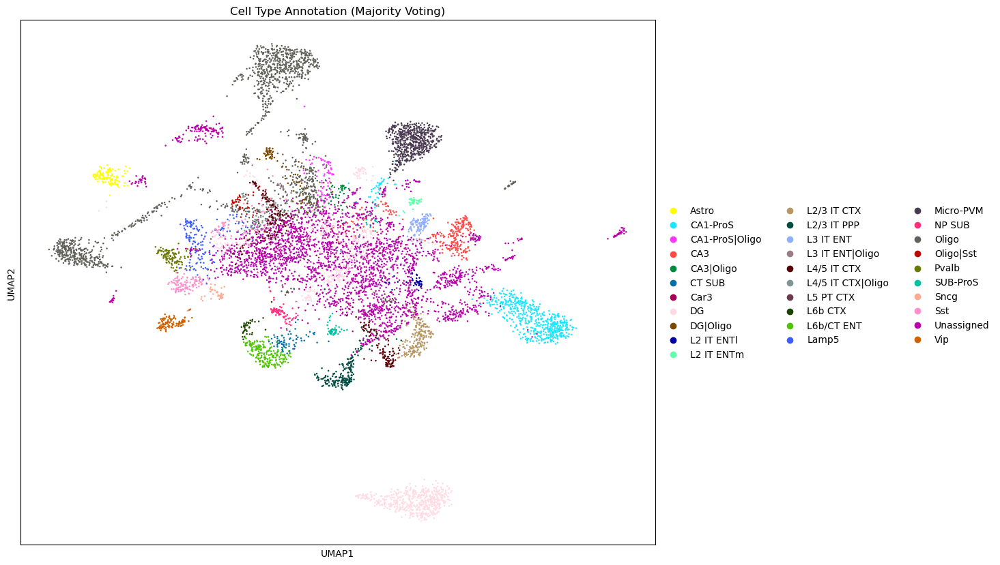
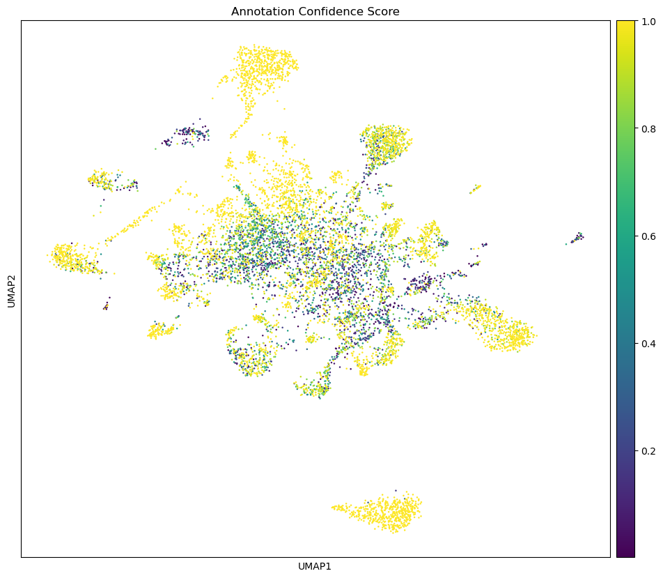
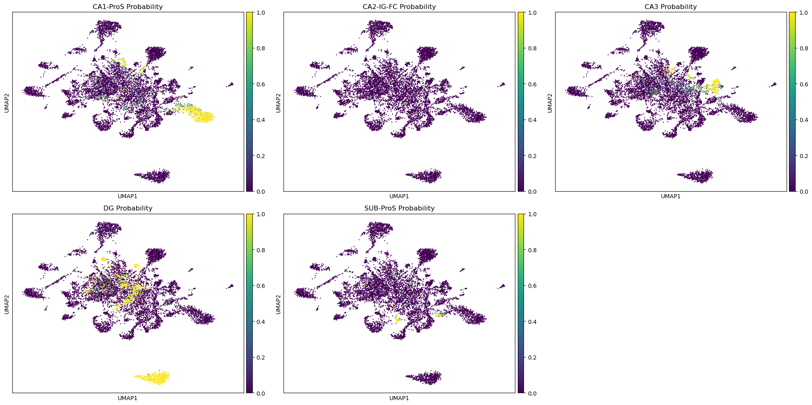
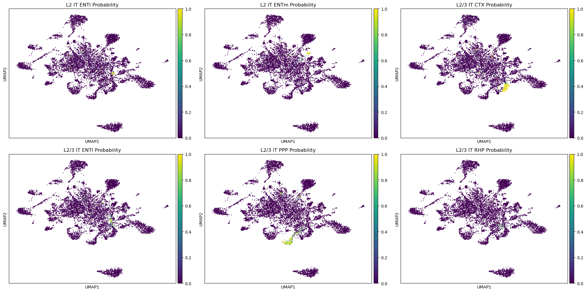

# Environment

# Load Data

    Loading AnnData from /beegfs/scratch/ric.broccoli/kubacki.michal/SRF_Linda_RNA/post_analysis/results/cellranger_counts_R26_Nestin_Mut_adult_3/adata.h5ad

    AnnData object contains 9237 cells and 26095 genes

# Explore cell annotation model

    <class 'celltypist.models.Model'>
    dict_keys(['classifier', 'scaler', 'description'])
    {'date': '2023-07-16 14:42:07.696736', 'details': 'cell types from the adult mouse isocortex (neocortex) and hippocampal formation', 'url': 'https://celltypist.cog.sanger.ac.uk/models/Mouse_IsocortexHPF_Yao/v1/Mouse_Isocortex_Hippocampus.pkl', 'source': 'https://doi.org/10.1016/j.cell.2021.04.021', 'version': 'v1', 'number_celltypes': 42}
    Model: Mouse_Isocortex_Hippocampus.pkl
    Number of cell types: 42

    Available attributes and methods:
      - cell_types: <class 'numpy.ndarray'>
      - classifier: <class 'sklearn.linear_model._logistic.LogisticRegression'>
      - convert: <class 'method'>
      - description: <class 'dict'>
      - extract_top_markers: <class 'method'>
      - features: <class 'numpy.ndarray'>
      - load: <class 'function'>
      - predict_labels_and_prob: <class 'method'>
      - scaler: <class 'sklearn.preprocessing._data.StandardScaler'>
      - write: <class 'method'>

    Hippocampal cell types:
    ['CA1-ProS', 'CA2-IG-FC', 'CA3', 'DG', 'SUB-ProS']
    
    Cortical cell types:
    ['L2 IT ENTl', 'L2 IT ENTm', 'L2/3 IT CTX', 'L2/3 IT ENTl', 'L2/3 IT PPP', 'L2/3 IT RHP', 'L3 IT ENT', 'L4 RSP-ACA', 'L4/5 IT CTX', 'L5 IT CTX', 'L5 PPP', 'L5 PT CTX', 'L5/6 IT TPE-ENT', 'L5/6 NP CTX', 'L6 CT CTX', 'L6 IT CTX', 'L6 IT ENTl', 'L6b CTX', 'L6b/CT ENT']
    
    Other cell types:
    ['Astro', 'CR', 'CT SUB', 'Car3', 'Endo', 'Lamp5', 'Meis2', 'Micro-PVM', 'NP PPP', 'NP SUB', 'Oligo', 'Pvalb', 'SMC-Peri', 'Sncg', 'Sst', 'Sst Chodl', 'VLMC', 'Vip']

    array(['Astro', 'CA1-ProS', 'CA2-IG-FC', 'CA3', 'CR', 'CT SUB', 'Car3',
           'DG', 'Endo', 'L2 IT ENTl', 'L2 IT ENTm', 'L2/3 IT CTX',
           'L2/3 IT ENTl', 'L2/3 IT PPP', 'L2/3 IT RHP', 'L3 IT ENT',
           'L4 RSP-ACA', 'L4/5 IT CTX', 'L5 IT CTX', 'L5 PPP', 'L5 PT CTX',
           'L5/6 IT TPE-ENT', 'L5/6 NP CTX', 'L6 CT CTX', 'L6 IT CTX',
           'L6 IT ENTl', 'L6b CTX', 'L6b/CT ENT', 'Lamp5', 'Meis2',
           'Micro-PVM', 'NP PPP', 'NP SUB', 'Oligo', 'Pvalb', 'SMC-Peri',
           'SUB-ProS', 'Sncg', 'Sst', 'Sst Chodl', 'VLMC', 'Vip'],
          dtype=object)

    
    Cell types:
      1. Astro
      2. CA1-ProS
      3. CA2-IG-FC
      4. CA3
      5. CR
      6. CT SUB
      7. Car3
      8. DG
      9. Endo
      10. L2 IT ENTl
      11. L2 IT ENTm
      12. L2/3 IT CTX
      13. L2/3 IT ENTl
      14. L2/3 IT PPP
      15. L2/3 IT RHP
      16. L3 IT ENT
      17. L4 RSP-ACA
      18. L4/5 IT CTX
      19. L5 IT CTX
      20. L5 PPP
      21. L5 PT CTX
      22. L5/6 IT TPE-ENT
      23. L5/6 NP CTX
      24. L6 CT CTX
      25. L6 IT CTX
      26. L6 IT ENTl
      27. L6b CTX
      28. L6b/CT ENT
      29. Lamp5
      30. Meis2
      31. Micro-PVM
      32. NP PPP
      33. NP SUB
      34. Oligo
      35. Pvalb
      36. SMC-Peri
      37. SUB-ProS
      38. Sncg
      39. Sst
      40. Sst Chodl
      41. VLMC
      42. Vip

    
    Extracting markers for key cell types...
    
    Top 5 markers for Astro:
      - Gfap
      - Eva1a
      - 9630013A20Rik
      - Cmtm5
      - Grin2c
    
    Top 5 markers for CA1-ProS:
      - Lefty1
      - Fibcd1
      - Gm26644
      - Galntl6
      - Gm2115
    
    Top 5 markers for CA2-IG-FC:
      - Scgn
      - Gm47902
      - Rlbp1
      - 9630013A20Rik
      - Gfap
    
    Top 5 markers for CA3:
      - Otos
      - Rcn3
      - Gm26644
      - 9630013A20Rik
      - Iyd
    
    Top 5 markers for CR:
      - Gm45774
      - Grin2c
      - Npb
      - Rlbp1
      - Gm47902
    
    Top 5 markers for CT SUB:
      - Rmst
      - Galntl6
      - Lrrtm4
      - Kcnq5
      - Slit2
    
    Top 5 markers for Car3:
      - Synpr
      - Car3
      - Tenm2
      - Car2
      - Neu4
    
    Top 5 markers for DG:
      - C1ql2
      - Dsp
      - Prox1
      - Glis3
      - Dock10
    
    Top 5 markers for Endo:
      - Ccdc190
      - Chodl
      - Rlbp1
      - Th
      - 9630013A20Rik
    
    Top 5 markers for L2 IT ENTl:
      - Gm45774
      - Apela
      - Ccdc190
      - 9630013A20Rik
      - Gli2
    
    Top 5 markers for L2 IT ENTm:
      - Lef1
      - Cbln4
      - 9630013A20Rik
      - Chodl
      - Gm47902
    
    Top 5 markers for L2/3 IT CTX:
      - Gpc6
      - Cplx2
      - Rasgrf2
      - Cux2
      - Lamp5
    
    Top 5 markers for L2/3 IT ENTl:
      - Gm32647
      - Penk
      - Trps1
      - Gm47902
      - Trim54
    
    Top 5 markers for L2/3 IT PPP:
      - Meis2
      - Tshz2
      - Cxcl14
      - Mgat4c
      - Cck
    
    Top 5 markers for L2/3 IT RHP:
      - Dcn
      - Neu4
      - 9630013A20Rik
      - Slc6a3
      - Gm47902
    
    Top 5 markers for L3 IT ENT:
      - Grin2c
      - Neu4
      - Meg3
      - 9330185C12Rik
      - Slc6a3
    
    Top 5 markers for L4 RSP-ACA:
      - Cbln1
      - 9630013A20Rik
      - Chodl
      - Otos
      - Iyd
    
    Top 5 markers for L4/5 IT CTX:
      - Rorb
      - Lrrc4c
      - Hs6st3
      - Pcdh15
      - Galntl6
    
    Top 5 markers for L5 IT CTX:
      - Pcp4
      - Cck
      - Pld5
      - Stxbp6
      - Il1rapl2
    
    Top 5 markers for L5 PPP:
      - 9630013A20Rik
      - Ptgfr
      - Apela
      - Neu4
      - Gm45774
    
    Top 5 markers for L5 PT CTX:
      - Fam19a1
      - Tox
      - Mef2c
      - Slc6a3
      - Gap43
    
    Top 5 markers for L5/6 IT TPE-ENT:
      - Etv1
      - Gpc6
      - Fam19a1
      - Hpcal1
      - Nell1
    
    Top 5 markers for L5/6 NP CTX:
      - Nxph1
      - Lypd1
      - Tshz2
      - Gria4
      - Etv1
    
    Top 5 markers for L6 CT CTX:
      - Rprm
      - Pdzrn4
      - Malat1
      - Nlgn1
      - Grm8
    
    Top 5 markers for L6 IT CTX:
      - Zfp804b
      - C1ql3
      - Cdh13
      - Il1rapl2
      - Unc13c
    
    Top 5 markers for L6 IT ENTl:
      - Ror1
      - Ccdc190
      - 9630013A20Rik
      - Gm47902
      - Otos
    
    Top 5 markers for L6b CTX:
      - Cplx3
      - Ctgf
      - Neu4
      - Rgs20
      - Tmem163
    
    Top 5 markers for L6b/CT ENT:
      - Meis2
      - Nnat
      - Sema3c
      - Brinp3
      - Sgcd
    
    Top 5 markers for Lamp5:
      - Grik1
      - Lamp5
      - Nxph1
      - Lingo2
      - Ptprm
    
    Top 5 markers for Meis2:
      - Sall3
      - 9630013A20Rik
      - Scgn
      - Neu4
      - Th
    
    Top 5 markers for Micro-PVM:
      - Gm47902
      - Hc
      - Chodl
      - Scgn
      - Slc6a3
    
    Top 5 markers for NP PPP:
      - Slc6a3
      - Scgn
      - Chrna6
      - Ccdc190
      - Gm45774
    
    Top 5 markers for NP SUB:
      - Sgcd
      - Slc38a3
      - Grin2c
      - 9630013A20Rik
      - Eva1a
    
    Top 5 markers for Oligo:
      - Gjc3
      - Ermn
      - Ppp1r14a
      - Opalin
      - Prr5l
    
    Top 5 markers for Pvalb:
      - Pvalb
      - Cox6a2
      - Tmsb4x
      - Tac1
      - Dock4
    
    Top 5 markers for SMC-Peri:
      - Slc6a3
      - 9630013A20Rik
      - Neu4
      - 2900052N01Rik
      - Gm26644
    
    Top 5 markers for SUB-ProS:
      - Neu4
      - Fn1
      - Gpr101
      - Ndst4
      - Gm47902
    
    Top 5 markers for Sncg:
      - Cnr1
      - Col19a1
      - Asic2
      - Ndnf
      - Col25a1
    
    Top 5 markers for Sst:
      - Sst
      - Elfn1
      - Grin3a
      - Reln
      - Unc13c
    
    Top 5 markers for Sst Chodl:
      - Chodl
      - Gcnt1
      - 9630013A20Rik
      - Nos1
      - Gm45774
    
    Top 5 markers for VLMC:
      - Gm47902
      - Cyp1b1
      - Slc6a3
      - 9630013A20Rik
      - Alx4
    
    Top 5 markers for Vip:
      - Vip
      - Calb2
      - Slc5a7
      - Penk
      - Caln1

# Annotate data

    0.0
    0.0

    Layers with keys: for_cell_typist

    10000.002

    🔬 Input data has 9237 cells and 26095 genes

    🔗 Matching reference genes in the model

    Running CellTypist with majority_voting=True, prob_threshold=0.5

    🧬 3272 features used for prediction

    ⚖️ Scaling input data

    🖋️ Predicting labels

    ✅ Prediction done!

    👀 Can not detect a neighborhood graph, will construct one before the over-clustering

    ⛓️ Over-clustering input data with resolution set to 10

    🗳️ Majority voting the predictions

    ✅ Majority voting done!

    AnnData object with n_obs × n_vars = 9237 × 26095
        obs: 'n_genes', 'n_genes_by_counts', 'total_counts', 'total_counts_mt', 'pct_counts_mt', 'predicted_labels', 'over_clustering', 'majority_voting', 'conf_score'
        var: 'gene_ids', 'feature_types', 'n_cells', 'mt', 'n_cells_by_counts', 'mean_counts', 'pct_dropout_by_counts', 'total_counts', 'highly_variable', 'means', 'dispersions', 'dispersions_norm'
        uns: 'hvg', 'log1p', 'neighbors', 'over_clustering'
        obsm: 'X_pca'
        layers: 'for_cell_typist'
        obsp: 'connectivities', 'distances'

    AnnData object with n_obs × n_vars = 9237 × 26095
        obs: 'n_genes', 'n_genes_by_counts', 'total_counts', 'total_counts_mt', 'pct_counts_mt', 'predicted_labels', 'over_clustering', 'majority_voting', 'conf_score', 'prob_predicted_labels', 'prob_over_clustering', 'prob_majority_voting', 'prob_conf_score', 'prob_Astro', 'prob_CA1-ProS', 'prob_CA2-IG-FC', 'prob_CA3', 'prob_CR', 'prob_CT SUB', 'prob_Car3', 'prob_DG', 'prob_Endo', 'prob_L2 IT ENTl', 'prob_L2 IT ENTm', 'prob_L2/3 IT CTX', 'prob_L2/3 IT ENTl', 'prob_L2/3 IT PPP', 'prob_L2/3 IT RHP', 'prob_L3 IT ENT', 'prob_L4 RSP-ACA', 'prob_L4/5 IT CTX', 'prob_L5 IT CTX', 'prob_L5 PPP', 'prob_L5 PT CTX', 'prob_L5/6 IT TPE-ENT', 'prob_L5/6 NP CTX', 'prob_L6 CT CTX', 'prob_L6 IT CTX', 'prob_L6 IT ENTl', 'prob_L6b CTX', 'prob_L6b/CT ENT', 'prob_Lamp5', 'prob_Meis2', 'prob_Micro-PVM', 'prob_NP PPP', 'prob_NP SUB', 'prob_Oligo', 'prob_Pvalb', 'prob_SMC-Peri', 'prob_SUB-ProS', 'prob_Sncg', 'prob_Sst', 'prob_Sst Chodl', 'prob_VLMC', 'prob_Vip'
        var: 'gene_ids', 'feature_types', 'n_cells', 'mt', 'n_cells_by_counts', 'mean_counts', 'pct_dropout_by_counts', 'total_counts', 'highly_variable', 'means', 'dispersions', 'dispersions_norm'
        uns: 'hvg', 'log1p', 'neighbors', 'over_clustering'
        obsm: 'X_pca'
        layers: 'for_cell_typist'
        obsp: 'connectivities', 'distances'

# Inspect results

    Index(['n_genes', 'n_genes_by_counts', 'total_counts', 'total_counts_mt',
           'pct_counts_mt', 'predicted_labels', 'over_clustering',
           'majority_voting', 'conf_score', 'prob_predicted_labels',
           'prob_over_clustering', 'prob_majority_voting', 'prob_conf_score',
           'prob_Astro', 'prob_CA1-ProS', 'prob_CA2-IG-FC', 'prob_CA3', 'prob_CR',
           'prob_CT SUB', 'prob_Car3', 'prob_DG', 'prob_Endo', 'prob_L2 IT ENTl',
           'prob_L2 IT ENTm', 'prob_L2/3 IT CTX', 'prob_L2/3 IT ENTl',
           'prob_L2/3 IT PPP', 'prob_L2/3 IT RHP', 'prob_L3 IT ENT',
           'prob_L4 RSP-ACA', 'prob_L4/5 IT CTX', 'prob_L5 IT CTX', 'prob_L5 PPP',
           'prob_L5 PT CTX', 'prob_L5/6 IT TPE-ENT', 'prob_L5/6 NP CTX',
           'prob_L6 CT CTX', 'prob_L6 IT CTX', 'prob_L6 IT ENTl', 'prob_L6b CTX',
           'prob_L6b/CT ENT', 'prob_Lamp5', 'prob_Meis2', 'prob_Micro-PVM',
           'prob_NP PPP', 'prob_NP SUB', 'prob_Oligo', 'prob_Pvalb',
           'prob_SMC-Peri', 'prob_SUB-ProS', 'prob_Sncg', 'prob_Sst',
           'prob_Sst Chodl', 'prob_VLMC', 'prob_Vip'],
          dtype='object')

    

    

    <Figure size 640x480 with 0 Axes>

    

    

    <Figure size 640x480 with 0 Axes>

    prob_predicted_labels	prob_over_clustering	prob_majority_voting	prob_conf_score	prob_Astro
    prob_CA1-ProS	prob_CA2-IG-FC	prob_CA3	prob_CR	prob_CT SUB
    prob_Car3	prob_DG	prob_Endo	prob_L2 IT ENTl	prob_L2 IT ENTm
    prob_L2/3 IT CTX	prob_L2/3 IT ENTl	prob_L2/3 IT PPP	prob_L2/3 IT RHP	prob_L3 IT ENT
    prob_L4 RSP-ACA	prob_L4/5 IT CTX	prob_L5 IT CTX	prob_L5 PPP	prob_L5 PT CTX
    prob_L5/6 IT TPE-ENT	prob_L5/6 NP CTX	prob_L6 CT CTX	prob_L6 IT CTX	prob_L6 IT ENTl
    prob_L6b CTX	prob_L6b/CT ENT	prob_Lamp5	prob_Meis2	prob_Micro-PVM
    prob_NP PPP	prob_NP SUB	prob_Oligo	prob_Pvalb	prob_SMC-Peri
    prob_SUB-ProS	prob_Sncg	prob_Sst	prob_Sst Chodl	prob_VLMC
    prob_Vip

    ['prob_CA1-ProS', 'prob_CA2-IG-FC', 'prob_CA3', 'prob_DG', 'prob_SUB-ProS']
    ['prob_L2 IT ENTl', 'prob_L2 IT ENTm', 'prob_L2/3 IT CTX', 'prob_L2/3 IT ENTl', 'prob_L2/3 IT PPP', 'prob_L2/3 IT RHP', 'prob_L3 IT ENT', 'prob_L4 RSP-ACA', 'prob_L4/5 IT CTX', 'prob_L5 IT CTX', 'prob_L5 PPP', 'prob_L5 PT CTX', 'prob_L5/6 IT TPE-ENT', 'prob_L5/6 NP CTX', 'prob_L6 CT CTX', 'prob_L6 IT CTX', 'prob_L6 IT ENTl', 'prob_L6b CTX', 'prob_L6b/CT ENT']
    ['prob_predicted_labels', 'prob_over_clustering', 'prob_majority_voting', 'prob_conf_score', 'prob_Astro', 'prob_CR', 'prob_CT SUB', 'prob_Car3', 'prob_Endo', 'prob_Lamp5', 'prob_Meis2', 'prob_Micro-PVM', 'prob_NP PPP', 'prob_NP SUB', 'prob_Oligo', 'prob_Pvalb', 'prob_SMC-Peri', 'prob_Sncg', 'prob_Sst', 'prob_Sst Chodl', 'prob_VLMC', 'prob_Vip']

    

    

    

    

# Save data

    cells_annotated.h5ad saved to results_Mouse_Isocortex_Hippocampus/cells_annotated.h5ad

    Extracting 2081 hippocampal cells

    Extracting 1241 cortical cells

    Extracting 5915 other cells

    Hippocampus cells saved to results_Mouse_Isocortex_Hippocampus/hippocampus_cells.h5ad

    Cortex cells saved to results_Mouse_Isocortex_Hippocampus/cortex_cells.h5ad

    Other cells saved to results_Mouse_Isocortex_Hippocampus/other_cells.h5ad

