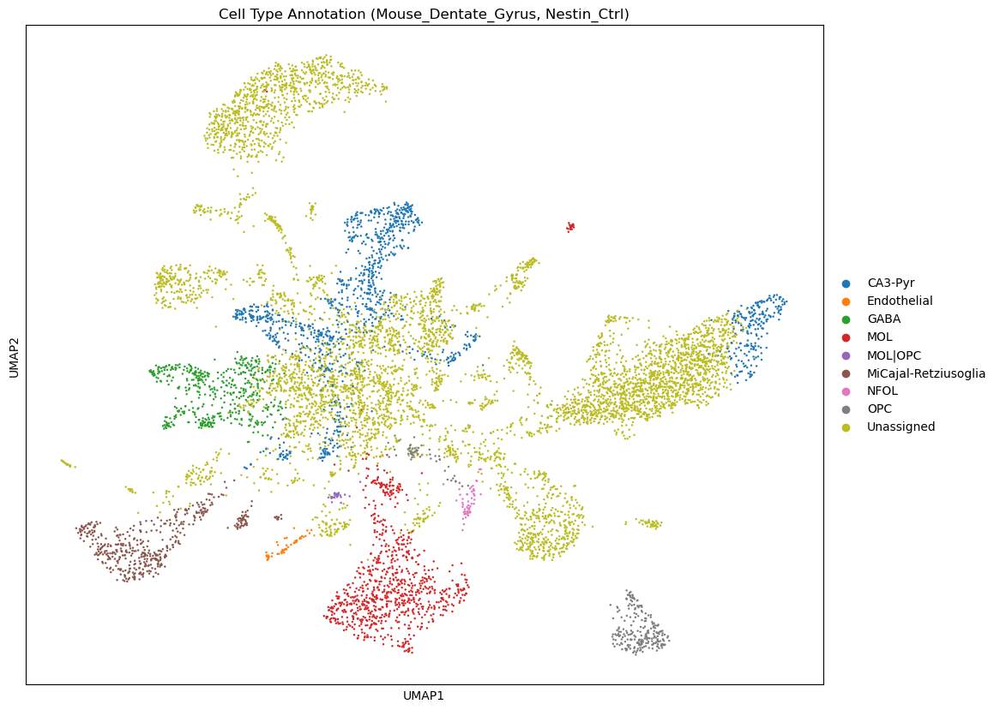
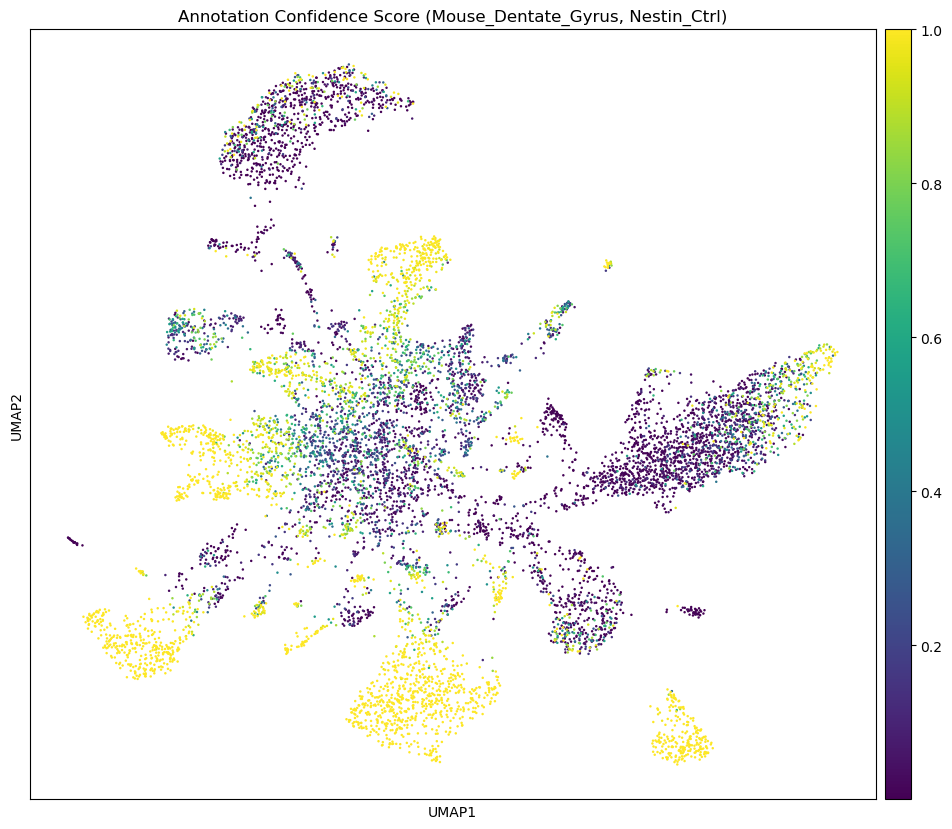

```python
# %% [markdown]
# # Environment
```


```python
import scanpy as sc
import numpy as np
import pandas as pd
import matplotlib.pyplot as plt
import os
import sys
import anndata as ad
import warnings
from celltypist import models, annotate
```


```python
os.chdir("/beegfs/scratch/ric.broccoli/kubacki.michal/SRF_Linda_RNA/post_analysis/cell_typist")
```


```python
# This cell will be parameterized by the script
sel_model = "Mouse_Dentate_Gyrus"  # This will be replaced with the actual model name
sel_sample = "Nestin_Ctrl"  # This will be replaced with the actual sample name
print(f"Processing model: {sel_model}, sample: {sel_sample}")
```

    Processing model: Mouse_Dentate_Gyrus, sample: Nestin_Ctrl


```python
# Specific mouse brain models available in CellTypist
# https://www.celltypist.org/models
MOUSE_HIPPOCAMPUS_MODELS = {
    "Mouse_Isocortex_Hippocampus": {
        "description": "Cell types from the adult mouse isocortex (neocortex) and hippocampal formation",
        "cell_types": 42,
        "version": "v1",
        "reference": "https://doi.org/10.1016/j.cell.2021.04.021"
    },
    "Mouse_Dentate_Gyrus": {
        "description": "Cell types from the dentate gyrus in perinatal, juvenile, and adult mice",
        "cell_types": 24,
        "version": "v1",
        "reference": "https://doi.org/10.1038/s41593-017-0056-2"
    }
}
```


```python
# Set up directories
results_dir = f"results_{sel_model}"
model_dir = "models"
os.makedirs(results_dir, exist_ok=True)
os.makedirs(model_dir, exist_ok=True)
```


```python
# DATA dirs
base_path = "/beegfs/scratch/ric.broccoli/kubacki.michal/SRF_Linda_RNA/post_analysis"
outputs_folder = "individual_data_analysis_opt_clusters"
folder_prefix = "cellranger_counts_R26_"
data_dir = os.path.join(base_path, outputs_folder, folder_prefix)

adata_paths = {
    "Emx1_Ctrl": f"{data_dir}Emx1_Ctrl_adult_0/Emx1_Ctrl_processed.h5ad",
    "Emx1_Mut": f"{data_dir}Emx1_Mut_adult_1/Emx1_Mut_processed.h5ad",
    "Nestin_Ctrl": f"{data_dir}Nestin_Ctrl_adult_2/Nestin_Ctrl_processed.h5ad",
    "Nestin_Mut": f"{data_dir}Nestin_Mut_adult_3/Nestin_Mut_processed.h5ad"
}
```


```python
adata_path = adata_paths[sel_sample]
model_path = f"models/{sel_model}.pkl"

# %% [markdown]
# # Load Data
```


```python
if adata_path:
    print(f"Loading AnnData from {adata_path}")
    adata = sc.read_h5ad(adata_path)
else:
    # Try to use a global adata object
    try:
        adata = globals()['adata']
        print("Using already loaded AnnData object")
    except KeyError:
        print("No AnnData object provided. Please provide a path to an .h5ad file.")

print(f"AnnData object contains {adata.n_obs} cells and {adata.n_vars} genes")
```

    Loading AnnData from /beegfs/scratch/ric.broccoli/kubacki.michal/SRF_Linda_RNA/post_analysis/individual_data_analysis_opt_clusters/cellranger_counts_R26_Nestin_Ctrl_adult_2/Nestin_Ctrl_processed.h5ad


    AnnData object contains 9512 cells and 27564 genes


```python
model = models.Model.load(model_path)

# %% [markdown]
# # Explore cell annotation model
```


```python
print(type(model))
print(model.__dict__.keys())
print(model.description)
print(f"Model: {os.path.basename(model_path)}")
print(f"Number of cell types: {len(model.cell_types)}")
```

    <class 'celltypist.models.Model'>
    dict_keys(['classifier', 'scaler', 'description'])
    {'date': '2023-07-14 20:03:58.410321', 'details': 'cell types from the dentate gyrus in perinatal, juvenile, and adult mice', 'url': 'https://celltypist.cog.sanger.ac.uk/models/Mouse_DG_Hochgerner/v1/Mouse_Dentate_Gyrus.pkl', 'source': 'https://doi.org/10.1038/s41593-017-0056-2', 'version': 'v1', 'number_celltypes': 24}
    Model: Mouse_Dentate_Gyrus.pkl
    Number of cell types: 24


```python
# Inspect all available attributes and methods of the model object
print("Available attributes and methods:")
for attr in dir(model):
    if not attr.startswith('__'):  # Skip dunder methods
        attr_type = type(getattr(model, attr))
        print(f"  - {attr}: {attr_type}")
```

    Available attributes and methods:
      - cell_types: <class 'numpy.ndarray'>
      - classifier: <class 'sklearn.linear_model._logistic.LogisticRegression'>
      - convert: <class 'method'>
      - description: <class 'dict'>
      - extract_top_markers: <class 'method'>
      - features: <class 'numpy.ndarray'>
      - load: <class 'function'>
      - predict_labels_and_prob: <class 'method'>
      - scaler: <class 'sklearn.preprocessing._data.StandardScaler'>
      - write: <class 'method'>


```python
# Display original array for reference
model.cell_types
```


    array(['Astro-adult', 'Astro-juv', 'CA3-Pyr', 'Cajal-Retzius',
           'Endothelial', 'Ependymal', 'GABA', 'GC-adult', 'GC-juv',
           'Immature-Astro', 'Immature-GABA', 'Immature-GC', 'Immature-Pyr',
           'MOL', 'MiCajal-Retziusoglia', 'NFOL', 'Neuroblast', 'OPC', 'PVM',
           'RGL', 'RGL_young', 'VLMC', 'nIPC', 'nIPC-perin'], dtype=object)


```python
print("\nCell types:")
for i, cell_type in enumerate(model.cell_types):
    print(f"  {i+1}. {cell_type}")
```

    
    Cell types:
      1. Astro-adult
      2. Astro-juv
      3. CA3-Pyr
      4. Cajal-Retzius
      5. Endothelial
      6. Ependymal
      7. GABA
      8. GC-adult
      9. GC-juv
      10. Immature-Astro
      11. Immature-GABA
      12. Immature-GC
      13. Immature-Pyr
      14. MOL
      15. MiCajal-Retziusoglia
      16. NFOL
      17. Neuroblast
      18. OPC
      19. PVM
      20. RGL
      21. RGL_young
      22. VLMC
      23. nIPC
      24. nIPC-perin


```python
# Extract some key marker genes
print("\nExtracting markers for key cell types...")
for cell_type in model.cell_types:
    markers = model.extract_top_markers(cell_type, 5)
    print(f"\nTop 5 markers for {cell_type}:")
    for marker in markers:
        print(f"  - {marker}")


# %% [markdown]
# # Annotate data
```

    
    Extracting markers for key cell types...
    
    Top 5 markers for Astro-adult:
      - Mt2
      - S1pr1
      - Gja1
      - Mt1
      - Gstm1
    
    Top 5 markers for Astro-juv:
      - Arxes2
      - Hmgcs1
      - Btbd17
      - Gstm5
      - 6330403K07Rik
    
    Top 5 markers for CA3-Pyr:
      - Sv2b
      - Cck
      - Rasgrp1
      - Pde1a
      - Hpca
    
    Top 5 markers for Cajal-Retzius:
      - Lhx5
      - Gm27199
      - Reln
      - Lhx1os
      - Lhx1
    
    Top 5 markers for Endothelial:
      - Slco1a4
      - Ebf1
      - Pcp4l1
      - Rgs5
      - Igfbp7
    
    Top 5 markers for Ependymal:
      - 2410004P03Rik
      - Tekt1
      - Calml4
      - Mlf1
      - Cfap126
    
    Top 5 markers for GABA:
      - Gad2
      - Erbb4
      - Gad1
      - Slc32a1
      - Impact
    
    Top 5 markers for GC-adult:
      - Slc24a5
      - Nptx1
      - Marf1
      - Gas7
      - Pam
    
    Top 5 markers for GC-juv:
      - Ubb
      - Rnf121
      - Camk2a
      - Rplp0
      - Paqr9
    
    Top 5 markers for Immature-Astro:
      - Id3
      - Ednrb
      - Igfbp2
      - Lxn
      - Ncan
    
    Top 5 markers for Immature-GABA:
      - Dlx1
      - Dlx5
      - Dlx2
      - Npas1
      - Rpp25
    
    Top 5 markers for Immature-GC:
      - Cntnap5a
      - Nrgn
      - Pcp4
      - Zbtb20
      - Lrp1b
    
    Top 5 markers for Immature-Pyr:
      - Gap43
      - Neurod6
      - Syt4
      - Opcml
      - Crym
    
    Top 5 markers for MOL:
      - Ptgds
      - Plp1
      - Tspan2
      - Ermn
      - Mobp
    
    Top 5 markers for MiCajal-Retziusoglia:
      - Cx3cr1
      - P2ry12
      - Hexb
      - Ccr5
      - Selplg
    
    Top 5 markers for NFOL:
      - Fyn
      - Bcas1
      - Bmp4
      - Enpp6
      - Gpr17
    
    Top 5 markers for Neuroblast:
      - Sox4
      - Mfap4
      - Igsf8
      - Cttnbp2
      - Nfix
    
    Top 5 markers for OPC:
      - Pdgfra
      - Lhfpl3
      - Olig1
      - Olig2
      - Ostf1
    
    Top 5 markers for PVM:
      - Pf4
      - Mrc1
      - F13a1
      - Ms4a7
      - Ctsc
    
    Top 5 markers for RGL:
      - Itih3
      - Riiad1
      - Thrsp
      - Hopxos
      - Abca8a
    
    Top 5 markers for RGL_young:
      - Ccdc80
      - Gas1
      - Fabp7
      - Gdf10
      - Dbi
    
    Top 5 markers for VLMC:
      - Col1a2
      - Dcn
      - Nupr1
      - Col1a1
      - Col3a1
    
    Top 5 markers for nIPC:
      - Insm1
      - 2810417H13Rik
      - Gadd45g
      - Hmgb2
      - Cks2
    
    Top 5 markers for nIPC-perin:
      - 2810417H13Rik
      - Emp1
      - Cenpa
      - Birc5
      - Cdca8


```python
non_zero_index = adata.raw.X[0].indices[0] if len(adata.raw.X[0].indices) > 0 else 0
print(adata.raw.X[0,12])
print(adata.X[0,12])
```

    0.0
    -0.5464323


```python
adata.layers
```


    Layers with keys: for_cell_typist


```python
adata_norm = adata.copy()
```


```python
adata_norm.X = adata.layers['for_cell_typist']
```


```python
# Quick check that normalization worked correctly
counts_after_norm = np.expm1(adata_norm.X).sum(axis=1)
print(np.mean(counts_after_norm))

# Basic QC check
if np.mean(counts_after_norm) < 9000 or np.mean(counts_after_norm) > 11000:
    warnings.warn("Normalization may not have worked as expected. Check your data.")
```

    9999.998


```python
majority_voting = True
prob_threshold = 0.5
print(f"Running CellTypist with majority_voting={majority_voting}, prob_threshold={prob_threshold}")
predictions = annotate(
    adata_norm, 
    model=model_path,
    majority_voting=majority_voting,
    mode='prob match',  # Use probability-based matching for multi-label classification
    p_thres=prob_threshold
)
```

    Running CellTypist with majority_voting=True, prob_threshold=0.5


    🔬 Input data has 9512 cells and 27564 genes


    🔗 Matching reference genes in the model


    🧬 3899 features used for prediction


    ⚖️ Scaling input data


    🖋️ Predicting labels


    ✅ Prediction done!


    👀 Detected a neighborhood graph in the input object, will run over-clustering on the basis of it


    ⛓️ Over-clustering input data with resolution set to 10


    🗳️ Majority voting the predictions


    ✅ Majority voting done!


```python
# Add annotations to original adata
predictions.to_adata(adata_norm)
```


    AnnData object with n_obs × n_vars = 9512 × 27564
        obs: 'n_genes', 'n_genes_by_counts', 'total_counts', 'total_counts_mt', 'pct_counts_mt', 'leiden_0.05', 'leiden_0.13', 'leiden_0.22', 'leiden_0.3', 'leiden_0.38', 'leiden_0.47', 'leiden_0.55', 'leiden_0.63', 'leiden_0.72', 'leiden_0.8', 'predicted_labels', 'over_clustering', 'majority_voting', 'conf_score'
        var: 'gene_ids', 'feature_types', 'n_cells', 'mt', 'n_cells_by_counts', 'mean_counts', 'pct_dropout_by_counts', 'total_counts', 'highly_variable', 'means', 'dispersions', 'dispersions_norm', 'mean', 'std'
        uns: 'dendrogram_leiden_0.05', 'dendrogram_leiden_0.13', 'dendrogram_leiden_0.22', 'dendrogram_leiden_0.3', 'dendrogram_leiden_0.38', 'dendrogram_leiden_0.47', 'dendrogram_leiden_0.55', 'dendrogram_leiden_0.63', 'dendrogram_leiden_0.72', 'dendrogram_leiden_0.8', 'hvg', 'leiden_0.05', 'leiden_0.05_colors', 'leiden_0.13', 'leiden_0.13_colors', 'leiden_0.22', 'leiden_0.22_colors', 'leiden_0.3', 'leiden_0.38', 'leiden_0.38_colors', 'leiden_0.3_colors', 'leiden_0.47', 'leiden_0.47_colors', 'leiden_0.55', 'leiden_0.55_colors', 'leiden_0.63', 'leiden_0.63_colors', 'leiden_0.72', 'leiden_0.72_colors', 'leiden_0.8', 'leiden_0.8_colors', 'log1p', 'neighbors', 'pca', 'rank_genes_0.05', 'rank_genes_0.13', 'rank_genes_0.22', 'rank_genes_0.3', 'rank_genes_0.38', 'rank_genes_0.47', 'rank_genes_0.55', 'rank_genes_0.63', 'rank_genes_0.72', 'rank_genes_0.8', 'umap', 'over_clustering'
        obsm: 'X_pca', 'X_umap'
        varm: 'PCs'
        layers: 'for_cell_typist'
        obsp: 'connectivities', 'distances'


```python
# Also add probability scores for key cell types
predictions.to_adata(adata_norm, insert_prob=True, prefix='prob_')
```


    AnnData object with n_obs × n_vars = 9512 × 27564
        obs: 'n_genes', 'n_genes_by_counts', 'total_counts', 'total_counts_mt', 'pct_counts_mt', 'leiden_0.05', 'leiden_0.13', 'leiden_0.22', 'leiden_0.3', 'leiden_0.38', 'leiden_0.47', 'leiden_0.55', 'leiden_0.63', 'leiden_0.72', 'leiden_0.8', 'predicted_labels', 'over_clustering', 'majority_voting', 'conf_score', 'prob_predicted_labels', 'prob_over_clustering', 'prob_majority_voting', 'prob_conf_score', 'prob_Astro-adult', 'prob_Astro-juv', 'prob_CA3-Pyr', 'prob_Cajal-Retzius', 'prob_Endothelial', 'prob_Ependymal', 'prob_GABA', 'prob_GC-adult', 'prob_GC-juv', 'prob_Immature-Astro', 'prob_Immature-GABA', 'prob_Immature-GC', 'prob_Immature-Pyr', 'prob_MOL', 'prob_MiCajal-Retziusoglia', 'prob_NFOL', 'prob_Neuroblast', 'prob_OPC', 'prob_PVM', 'prob_RGL', 'prob_RGL_young', 'prob_VLMC', 'prob_nIPC', 'prob_nIPC-perin'
        var: 'gene_ids', 'feature_types', 'n_cells', 'mt', 'n_cells_by_counts', 'mean_counts', 'pct_dropout_by_counts', 'total_counts', 'highly_variable', 'means', 'dispersions', 'dispersions_norm', 'mean', 'std'
        uns: 'dendrogram_leiden_0.05', 'dendrogram_leiden_0.13', 'dendrogram_leiden_0.22', 'dendrogram_leiden_0.3', 'dendrogram_leiden_0.38', 'dendrogram_leiden_0.47', 'dendrogram_leiden_0.55', 'dendrogram_leiden_0.63', 'dendrogram_leiden_0.72', 'dendrogram_leiden_0.8', 'hvg', 'leiden_0.05', 'leiden_0.05_colors', 'leiden_0.13', 'leiden_0.13_colors', 'leiden_0.22', 'leiden_0.22_colors', 'leiden_0.3', 'leiden_0.38', 'leiden_0.38_colors', 'leiden_0.3_colors', 'leiden_0.47', 'leiden_0.47_colors', 'leiden_0.55', 'leiden_0.55_colors', 'leiden_0.63', 'leiden_0.63_colors', 'leiden_0.72', 'leiden_0.72_colors', 'leiden_0.8', 'leiden_0.8_colors', 'log1p', 'neighbors', 'pca', 'rank_genes_0.05', 'rank_genes_0.13', 'rank_genes_0.22', 'rank_genes_0.3', 'rank_genes_0.38', 'rank_genes_0.47', 'rank_genes_0.55', 'rank_genes_0.63', 'rank_genes_0.72', 'rank_genes_0.8', 'umap', 'over_clustering'
        obsm: 'X_pca', 'X_umap'
        varm: 'PCs'
        layers: 'for_cell_typist'
        obsp: 'connectivities', 'distances'


```python
if 'X_umap' not in adata_norm.obsm:
    try:
        # Calculate neighborhood graph if not present
        if 'neighbors' not in adata_norm.uns:
            sc.pp.neighbors(adata_norm)
        sc.tl.umap(adata_norm)
    except Exception as e:
        print(f"Could not calculate UMAP: {e}")
        if 'X_pca' not in adata_norm.obsm:
            sc.pp.pca(adata_norm)

# %% [markdown]
# # Inspect results
```


```python
adata_norm.obs.columns
```


    Index(['n_genes', 'n_genes_by_counts', 'total_counts', 'total_counts_mt',
           'pct_counts_mt', 'leiden_0.05', 'leiden_0.13', 'leiden_0.22',
           'leiden_0.3', 'leiden_0.38', 'leiden_0.47', 'leiden_0.55',
           'leiden_0.63', 'leiden_0.72', 'leiden_0.8', 'predicted_labels',
           'over_clustering', 'majority_voting', 'conf_score',
           'prob_predicted_labels', 'prob_over_clustering', 'prob_majority_voting',
           'prob_conf_score', 'prob_Astro-adult', 'prob_Astro-juv', 'prob_CA3-Pyr',
           'prob_Cajal-Retzius', 'prob_Endothelial', 'prob_Ependymal', 'prob_GABA',
           'prob_GC-adult', 'prob_GC-juv', 'prob_Immature-Astro',
           'prob_Immature-GABA', 'prob_Immature-GC', 'prob_Immature-Pyr',
           'prob_MOL', 'prob_MiCajal-Retziusoglia', 'prob_NFOL', 'prob_Neuroblast',
           'prob_OPC', 'prob_PVM', 'prob_RGL', 'prob_RGL_young', 'prob_VLMC',
           'prob_nIPC', 'prob_nIPC-perin'],
          dtype='object')


```python
# Cell type annotation plot
if 'majority_voting' in adata_norm.obs.columns:
    fig, ax = plt.subplots(figsize=(12, 10))
    sc.pl.umap(adata_norm, color='majority_voting', ax=ax, legend_loc='right margin', 
                title=f"Cell Type Annotation ({sel_model}, {sel_sample})")
    plt.tight_layout()
    output_file = os.path.join(results_dir, f"{sel_sample}_celltypes.png")
    plt.savefig(output_file, dpi=150)
    print(f"Saved cell type plot to {output_file}")
    plt.show()
```


    

    


    Saved cell type plot to results_Mouse_Dentate_Gyrus/Nestin_Ctrl_celltypes.png


    <Figure size 640x480 with 0 Axes>


```python
# Confidence score plot
if 'conf_score' in adata_norm.obs.columns:
    fig, ax = plt.subplots(figsize=(12, 10))
    sc.pl.umap(adata_norm, color='conf_score', ax=ax, 
                title=f"Annotation Confidence Score ({sel_model}, {sel_sample})", cmap='viridis')
    plt.tight_layout()
    output_file = os.path.join(results_dir, f"{sel_sample}_confidence.png")
    plt.savefig(output_file, dpi=150)
    print(f"Saved confidence score plot to {output_file}")
    plt.show()
```


    

    


    Saved confidence score plot to results_Mouse_Dentate_Gyrus/Nestin_Ctrl_confidence.png


    <Figure size 640x480 with 0 Axes>


```python
# Save the annotated adata
output_file = os.path.join(results_dir, f"{sel_sample}_annotated.h5ad")
adata_norm.write(output_file)
print(f"Saved annotated data to {output_file}")
```

    Saved annotated data to results_Mouse_Dentate_Gyrus/Nestin_Ctrl_annotated.h5ad


```python
# Generate a summary table of cell type annotations
cell_type_counts = adata_norm.obs['majority_voting'].value_counts()
cell_type_df = pd.DataFrame({
    'cell_type': cell_type_counts.index,
    'cell_count': cell_type_counts.values,
    'percentage': (cell_type_counts.values / cell_type_counts.sum() * 100).round(2)
})
cell_type_df = cell_type_df.sort_values('cell_count', ascending=False).reset_index(drop=True)

print(f"\nSummary of cell types for {sel_sample} using {sel_model} model:")
display(cell_type_df)
```

    
    Summary of cell types for Nestin_Ctrl using Mouse_Dentate_Gyrus model:


<div>
<style scoped>
    .dataframe tbody tr th:only-of-type {
        vertical-align: middle;
    }

    .dataframe tbody tr th {
        vertical-align: top;
    }

    .dataframe thead th {
        text-align: right;
    }
</style>
<table border="1" class="dataframe">
  <thead>
    <tr style="text-align: right;">
      <th></th>
      <th>cell_type</th>
      <th>cell_count</th>
      <th>percentage</th>
    </tr>
  </thead>
  <tbody>
    <tr>
      <th>0</th>
      <td>Unassigned</td>
      <td>6079</td>
      <td>63.91</td>
    </tr>
    <tr>
      <th>1</th>
      <td>CA3-Pyr</td>
      <td>1189</td>
      <td>12.50</td>
    </tr>
    <tr>
      <th>2</th>
      <td>MOL</td>
      <td>863</td>
      <td>9.07</td>
    </tr>
    <tr>
      <th>3</th>
      <td>GABA</td>
      <td>500</td>
      <td>5.26</td>
    </tr>
    <tr>
      <th>4</th>
      <td>MiCajal-Retziusoglia</td>
      <td>467</td>
      <td>4.91</td>
    </tr>
    <tr>
      <th>5</th>
      <td>OPC</td>
      <td>286</td>
      <td>3.01</td>
    </tr>
    <tr>
      <th>6</th>
      <td>NFOL</td>
      <td>54</td>
      <td>0.57</td>
    </tr>
    <tr>
      <th>7</th>
      <td>Endothelial</td>
      <td>49</td>
      <td>0.52</td>
    </tr>
    <tr>
      <th>8</th>
      <td>MOL|OPC</td>
      <td>25</td>
      <td>0.26</td>
    </tr>
  </tbody>
</table>
</div>


```python
# Save summary to CSV
summary_file = os.path.join(results_dir, f"{sel_sample}_cell_type_summary.csv")
cell_type_df.to_csv(summary_file, index=False)
print(f"Saved cell type summary to {summary_file}")
```

    Saved cell type summary to results_Mouse_Dentate_Gyrus/Nestin_Ctrl_cell_type_summary.csv


```python
print(f"\n{'='*50}")
print(f"CELLTYPIST ANALYSIS COMPLETED")
print(f"{'='*50}")
print(f"Sample: {sel_sample}")
print(f"Model: {sel_model}")
print(f"Number of cells: {adata_norm.n_obs}")
print(f"Number of cell types identified: {len(cell_type_counts)}")
print(f"Results saved to: {os.path.abspath(results_dir)}")
print(f"{'='*50}")


```

    
    ==================================================
    CELLTYPIST ANALYSIS COMPLETED
    ==================================================
    Sample: Nestin_Ctrl
    Model: Mouse_Dentate_Gyrus
    Number of cells: 9512
    Number of cell types identified: 9
    Results saved to: /beegfs/scratch/ric.broccoli/kubacki.michal/SRF_Linda_RNA/post_analysis/cell_typist/results_Mouse_Dentate_Gyrus
    ==================================================

