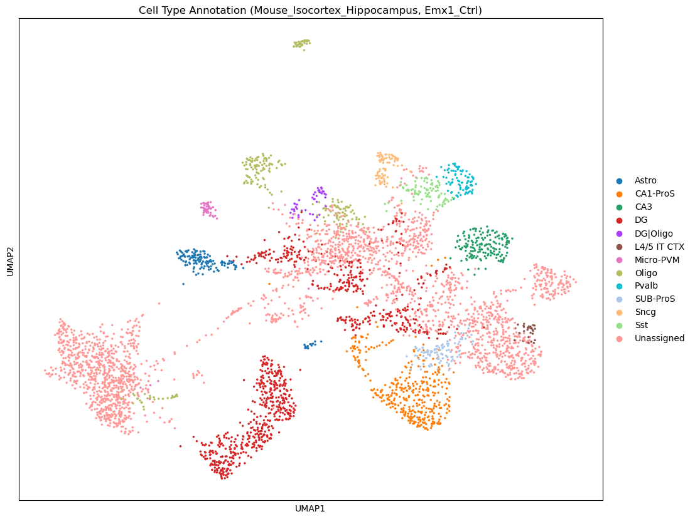
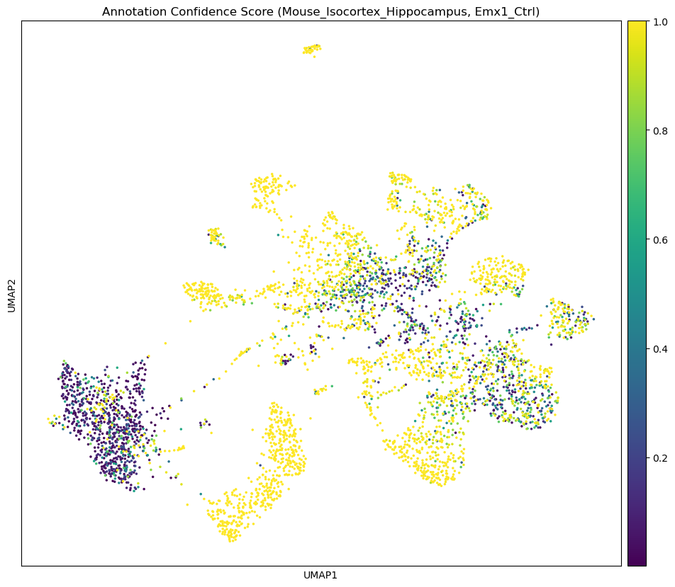

```python
# %% [markdown]
# # Environment
```


```python
import scanpy as sc
import numpy as np
import pandas as pd
import matplotlib.pyplot as plt
import os
import sys
import anndata as ad
import warnings
from celltypist import models, annotate
```


```python
os.chdir("/beegfs/scratch/ric.broccoli/kubacki.michal/SRF_Linda_RNA/post_analysis/cell_typist")
```


```python
# This cell will be parameterized by the script
sel_model = "Mouse_Isocortex_Hippocampus"  # This will be replaced with the actual model name
sel_sample = "Emx1_Ctrl"  # This will be replaced with the actual sample name
print(f"Processing model: {sel_model}, sample: {sel_sample}")

leiden_res_dict = {
    "Emx1_Ctrl": [0.38, 0.3, 0.05],
    "Emx1_Mut": [0.47, 0.38, 0.3],
    "Nestin_Ctrl": [0.05, 0.13, 0.47],
    "Nestin_Mut": [0.47, 0.3, 0.63]
}

leiden_res = leiden_res_dict[sel_sample]
```

    Processing model: Mouse_Isocortex_Hippocampus, sample: Emx1_Ctrl


```python
# Specific mouse brain models available in CellTypist
# https://www.celltypist.org/models
MOUSE_HIPPOCAMPUS_MODELS = {
    "Mouse_Isocortex_Hippocampus": {
        "description": "Cell types from the adult mouse isocortex (neocortex) and hippocampal formation",
        "cell_types": 42,
        "version": "v1",
        "reference": "https://doi.org/10.1016/j.cell.2021.04.021"
    },
    "Mouse_Dentate_Gyrus": {
        "description": "Cell types from the dentate gyrus in perinatal, juvenile, and adult mice",
        "cell_types": 24,
        "version": "v1",
        "reference": "https://doi.org/10.1038/s41593-017-0056-2"
    }
}
```


```python
# Set up directories
results_dir = f"results_{sel_model}"
model_dir = "models"
os.makedirs(results_dir, exist_ok=True)
os.makedirs(model_dir, exist_ok=True)
```


```python
# DATA dirs
base_path = "/beegfs/scratch/ric.broccoli/kubacki.michal/SRF_Linda_RNA/post_analysis"
outputs_folder = "individual_data_analysis_opt_clusters"
folder_prefix = "cellranger_counts_R26_"
data_dir = os.path.join(base_path, outputs_folder, folder_prefix)

adata_paths = {
    "Emx1_Ctrl": f"{data_dir}Emx1_Ctrl_adult_0/Emx1_Ctrl_processed.h5ad",
    "Emx1_Mut": f"{data_dir}Emx1_Mut_adult_1/Emx1_Mut_processed.h5ad",
    "Nestin_Ctrl": f"{data_dir}Nestin_Ctrl_adult_2/Nestin_Ctrl_processed.h5ad",
    "Nestin_Mut": f"{data_dir}Nestin_Mut_adult_3/Nestin_Mut_processed.h5ad"
}
```


```python
adata_path = adata_paths[sel_sample]
model_path = f"models/{sel_model}.pkl"

# %% [markdown]
# # Load Data
```


```python
if adata_path:
    print(f"Loading AnnData from {adata_path}")
    adata = sc.read_h5ad(adata_path)
else:
    # Try to use a global adata object
    try:
        adata = globals()['adata']
        print("Using already loaded AnnData object")
    except KeyError:
        print("No AnnData object provided. Please provide a path to an .h5ad file.")

print(f"AnnData object contains {adata.n_obs} cells and {adata.n_vars} genes")
```

    Loading AnnData from /beegfs/scratch/ric.broccoli/kubacki.michal/SRF_Linda_RNA/post_analysis/individual_data_analysis_opt_clusters/cellranger_counts_R26_Emx1_Ctrl_adult_0/Emx1_Ctrl_processed.h5ad


    AnnData object contains 4707 cells and 26071 genes


```python
model = models.Model.load(model_path)

# %% [markdown]
# # Explore cell annotation model
```


```python
print(type(model))
print(model.__dict__.keys())
print(model.description)
print(f"Model: {os.path.basename(model_path)}")
print(f"Number of cell types: {len(model.cell_types)}")
```

    <class 'celltypist.models.Model'>
    dict_keys(['classifier', 'scaler', 'description'])
    {'date': '2023-07-16 14:42:07.696736', 'details': 'cell types from the adult mouse isocortex (neocortex) and hippocampal formation', 'url': 'https://celltypist.cog.sanger.ac.uk/models/Mouse_IsocortexHPF_Yao/v1/Mouse_Isocortex_Hippocampus.pkl', 'source': 'https://doi.org/10.1016/j.cell.2021.04.021', 'version': 'v1', 'number_celltypes': 42}
    Model: Mouse_Isocortex_Hippocampus.pkl
    Number of cell types: 42


```python
# Inspect all available attributes and methods of the model object
print("Available attributes and methods:")
for attr in dir(model):
    if not attr.startswith('__'):  # Skip dunder methods
        attr_type = type(getattr(model, attr))
        print(f"  - {attr}: {attr_type}")
```

    Available attributes and methods:
      - cell_types: <class 'numpy.ndarray'>
      - classifier: <class 'sklearn.linear_model._logistic.LogisticRegression'>
      - convert: <class 'method'>
      - description: <class 'dict'>
      - extract_top_markers: <class 'method'>
      - features: <class 'numpy.ndarray'>
      - load: <class 'function'>
      - predict_labels_and_prob: <class 'method'>
      - scaler: <class 'sklearn.preprocessing._data.StandardScaler'>
      - write: <class 'method'>


```python
hippo_suffix = ['CA1', 'CA2', 'CA3', 'DG', 'SUB-ProS']
cortical_suffix = ['CTX', 'L2', 'L3', 'L4', 'L5', 'L6']
```


```python
# Get all cell types
all_cell_types = model.cell_types

# Define hippocampal cell types
hippocampal_cell_types = [ct for ct in all_cell_types if any(h in ct for h in hippo_suffix)]
print("Hippocampal cell types:")
print(hippocampal_cell_types)

# Define cortical cell types (layers and cortical regions)
cortical_cell_types = [ct for ct in all_cell_types if any(c in ct for c in cortical_suffix)]
print("\nCortical cell types:")
print(cortical_cell_types)

# Other cell types
other_cell_types = [ct for ct in all_cell_types if ct not in hippocampal_cell_types and ct not in cortical_cell_types]
print("\nOther cell types:")
print(other_cell_types)

# Display original array for reference
model.cell_types
```

    Hippocampal cell types:
    ['CA1-ProS', 'CA2-IG-FC', 'CA3', 'DG', 'SUB-ProS']
    
    Cortical cell types:
    ['L2 IT ENTl', 'L2 IT ENTm', 'L2/3 IT CTX', 'L2/3 IT ENTl', 'L2/3 IT PPP', 'L2/3 IT RHP', 'L3 IT ENT', 'L4 RSP-ACA', 'L4/5 IT CTX', 'L5 IT CTX', 'L5 PPP', 'L5 PT CTX', 'L5/6 IT TPE-ENT', 'L5/6 NP CTX', 'L6 CT CTX', 'L6 IT CTX', 'L6 IT ENTl', 'L6b CTX', 'L6b/CT ENT']
    
    Other cell types:
    ['Astro', 'CR', 'CT SUB', 'Car3', 'Endo', 'Lamp5', 'Meis2', 'Micro-PVM', 'NP PPP', 'NP SUB', 'Oligo', 'Pvalb', 'SMC-Peri', 'Sncg', 'Sst', 'Sst Chodl', 'VLMC', 'Vip']


    array(['Astro', 'CA1-ProS', 'CA2-IG-FC', 'CA3', 'CR', 'CT SUB', 'Car3',
           'DG', 'Endo', 'L2 IT ENTl', 'L2 IT ENTm', 'L2/3 IT CTX',
           'L2/3 IT ENTl', 'L2/3 IT PPP', 'L2/3 IT RHP', 'L3 IT ENT',
           'L4 RSP-ACA', 'L4/5 IT CTX', 'L5 IT CTX', 'L5 PPP', 'L5 PT CTX',
           'L5/6 IT TPE-ENT', 'L5/6 NP CTX', 'L6 CT CTX', 'L6 IT CTX',
           'L6 IT ENTl', 'L6b CTX', 'L6b/CT ENT', 'Lamp5', 'Meis2',
           'Micro-PVM', 'NP PPP', 'NP SUB', 'Oligo', 'Pvalb', 'SMC-Peri',
           'SUB-ProS', 'Sncg', 'Sst', 'Sst Chodl', 'VLMC', 'Vip'],
          dtype=object)


```python
print("\nCell types:")
for i, cell_type in enumerate(model.cell_types):
    print(f"  {i+1}. {cell_type}")
```

    
    Cell types:
      1. Astro
      2. CA1-ProS
      3. CA2-IG-FC
      4. CA3
      5. CR
      6. CT SUB
      7. Car3
      8. DG
      9. Endo
      10. L2 IT ENTl
      11. L2 IT ENTm
      12. L2/3 IT CTX
      13. L2/3 IT ENTl
      14. L2/3 IT PPP
      15. L2/3 IT RHP
      16. L3 IT ENT
      17. L4 RSP-ACA
      18. L4/5 IT CTX
      19. L5 IT CTX
      20. L5 PPP
      21. L5 PT CTX
      22. L5/6 IT TPE-ENT
      23. L5/6 NP CTX
      24. L6 CT CTX
      25. L6 IT CTX
      26. L6 IT ENTl
      27. L6b CTX
      28. L6b/CT ENT
      29. Lamp5
      30. Meis2
      31. Micro-PVM
      32. NP PPP
      33. NP SUB
      34. Oligo
      35. Pvalb
      36. SMC-Peri
      37. SUB-ProS
      38. Sncg
      39. Sst
      40. Sst Chodl
      41. VLMC
      42. Vip


```python
# Extract some key marker genes
print("\nExtracting markers for key cell types...")
for cell_type in model.cell_types:
    markers = model.extract_top_markers(cell_type, 5)
    print(f"\nTop 5 markers for {cell_type}:")
    for marker in markers:
        print(f"  - {marker}")


# %% [markdown]
# # Annotate data
```

    
    Extracting markers for key cell types...
    
    Top 5 markers for Astro:
      - Gfap
      - Eva1a
      - 9630013A20Rik
      - Cmtm5
      - Grin2c
    
    Top 5 markers for CA1-ProS:
      - Lefty1
      - Fibcd1
      - Gm26644
      - Galntl6
      - Gm2115
    
    Top 5 markers for CA2-IG-FC:
      - Scgn
      - Gm47902
      - Rlbp1
      - 9630013A20Rik
      - Gfap
    
    Top 5 markers for CA3:
      - Otos
      - Rcn3
      - Gm26644
      - 9630013A20Rik
      - Iyd
    
    Top 5 markers for CR:
      - Gm45774
      - Grin2c
      - Npb
      - Rlbp1
      - Gm47902
    
    Top 5 markers for CT SUB:
      - Rmst
      - Galntl6
      - Lrrtm4
      - Kcnq5
      - Slit2
    
    Top 5 markers for Car3:
      - Synpr
      - Car3
      - Tenm2
      - Car2
      - Neu4
    
    Top 5 markers for DG:
      - C1ql2
      - Dsp
      - Prox1
      - Glis3
      - Dock10
    
    Top 5 markers for Endo:
      - Ccdc190
      - Chodl
      - Rlbp1
      - Th
      - 9630013A20Rik
    
    Top 5 markers for L2 IT ENTl:
      - Gm45774
      - Apela
      - Ccdc190
      - 9630013A20Rik
      - Gli2
    
    Top 5 markers for L2 IT ENTm:
      - Lef1
      - Cbln4
      - 9630013A20Rik
      - Chodl
      - Gm47902
    
    Top 5 markers for L2/3 IT CTX:
      - Gpc6
      - Cplx2
      - Rasgrf2
      - Cux2
      - Lamp5
    
    Top 5 markers for L2/3 IT ENTl:
      - Gm32647
      - Penk
      - Trps1
      - Gm47902
      - Trim54
    
    Top 5 markers for L2/3 IT PPP:
      - Meis2
      - Tshz2
      - Cxcl14
      - Mgat4c
      - Cck
    
    Top 5 markers for L2/3 IT RHP:
      - Dcn
      - Neu4
      - 9630013A20Rik
      - Slc6a3
      - Gm47902
    
    Top 5 markers for L3 IT ENT:
      - Grin2c
      - Neu4
      - Meg3
      - 9330185C12Rik
      - Slc6a3
    
    Top 5 markers for L4 RSP-ACA:
      - Cbln1
      - 9630013A20Rik
      - Chodl
      - Otos
      - Iyd
    
    Top 5 markers for L4/5 IT CTX:
      - Rorb
      - Lrrc4c
      - Hs6st3
      - Pcdh15
      - Galntl6
    
    Top 5 markers for L5 IT CTX:
      - Pcp4
      - Cck
      - Pld5
      - Stxbp6
      - Il1rapl2
    
    Top 5 markers for L5 PPP:
      - 9630013A20Rik
      - Ptgfr
      - Apela
      - Neu4
      - Gm45774
    
    Top 5 markers for L5 PT CTX:
      - Fam19a1
      - Tox
      - Mef2c
      - Slc6a3
      - Gap43
    
    Top 5 markers for L5/6 IT TPE-ENT:
      - Etv1
      - Gpc6
      - Fam19a1
      - Hpcal1
      - Nell1
    
    Top 5 markers for L5/6 NP CTX:
      - Nxph1
      - Lypd1
      - Tshz2
      - Gria4
      - Etv1
    
    Top 5 markers for L6 CT CTX:
      - Rprm
      - Pdzrn4
      - Malat1
      - Nlgn1
      - Grm8
    
    Top 5 markers for L6 IT CTX:
      - Zfp804b
      - C1ql3
      - Cdh13
      - Il1rapl2
      - Unc13c
    
    Top 5 markers for L6 IT ENTl:
      - Ror1
      - Ccdc190
      - 9630013A20Rik
      - Gm47902
      - Otos
    
    Top 5 markers for L6b CTX:
      - Cplx3
      - Ctgf
      - Neu4
      - Rgs20
      - Tmem163
    
    Top 5 markers for L6b/CT ENT:
      - Meis2
      - Nnat
      - Sema3c
      - Brinp3
      - Sgcd
    
    Top 5 markers for Lamp5:
      - Grik1
      - Lamp5
      - Nxph1
      - Lingo2
      - Ptprm
    
    Top 5 markers for Meis2:
      - Sall3
      - 9630013A20Rik
      - Scgn
      - Neu4
      - Th
    
    Top 5 markers for Micro-PVM:
      - Gm47902
      - Hc
      - Chodl
      - Scgn
      - Slc6a3
    
    Top 5 markers for NP PPP:
      - Slc6a3
      - Scgn
      - Chrna6
      - Ccdc190
      - Gm45774
    
    Top 5 markers for NP SUB:
      - Sgcd
      - Slc38a3
      - Grin2c
      - 9630013A20Rik
      - Eva1a
    
    Top 5 markers for Oligo:
      - Gjc3
      - Ermn
      - Ppp1r14a
      - Opalin
      - Prr5l
    
    Top 5 markers for Pvalb:
      - Pvalb
      - Cox6a2
      - Tmsb4x
      - Tac1
      - Dock4
    
    Top 5 markers for SMC-Peri:
      - Slc6a3
      - 9630013A20Rik
      - Neu4
      - 2900052N01Rik
      - Gm26644
    
    Top 5 markers for SUB-ProS:
      - Neu4
      - Fn1
      - Gpr101
      - Ndst4
      - Gm47902
    
    Top 5 markers for Sncg:
      - Cnr1
      - Col19a1
      - Asic2
      - Ndnf
      - Col25a1
    
    Top 5 markers for Sst:
      - Sst
      - Elfn1
      - Grin3a
      - Reln
      - Unc13c
    
    Top 5 markers for Sst Chodl:
      - Chodl
      - Gcnt1
      - 9630013A20Rik
      - Nos1
      - Gm45774
    
    Top 5 markers for VLMC:
      - Gm47902
      - Cyp1b1
      - Slc6a3
      - 9630013A20Rik
      - Alx4
    
    Top 5 markers for Vip:
      - Vip
      - Calb2
      - Slc5a7
      - Penk
      - Caln1


```python
non_zero_index = adata.raw.X[0].indices[0] if len(adata.raw.X[0].indices) > 0 else 0
print(adata.raw.X[0,12])
print(adata.X[0,12])
```

    4.0
    -0.038312178


```python
adata.layers
```


    Layers with keys: for_cell_typist


```python
adata_norm = adata.copy()
```


```python
adata_norm.X = adata.layers['for_cell_typist']
```


```python
# Quick check that normalization worked correctly
counts_after_norm = np.expm1(adata_norm.X).sum(axis=1)
print(np.mean(counts_after_norm))

# Basic QC check
if np.mean(counts_after_norm) < 9000 or np.mean(counts_after_norm) > 11000:
    warnings.warn("Normalization may not have worked as expected. Check your data.")
```

    10000.001


```python
majority_voting = True
prob_threshold = 0.5
print(f"Running CellTypist with majority_voting={majority_voting}, prob_threshold={prob_threshold}")
predictions = annotate(
    adata_norm, 
    model=model_path,
    majority_voting=majority_voting,
    mode='prob match',  # Use probability-based matching for multi-label classification
    p_thres=prob_threshold
)
```

    🔬 Input data has 4707 cells and 26071 genes


    🔗 Matching reference genes in the model


    Running CellTypist with majority_voting=True, prob_threshold=0.5


    🧬 3276 features used for prediction


    ⚖️ Scaling input data


    🖋️ Predicting labels


    ✅ Prediction done!


    👀 Detected a neighborhood graph in the input object, will run over-clustering on the basis of it


    ⛓️ Over-clustering input data with resolution set to 5


    🗳️ Majority voting the predictions


    ✅ Majority voting done!


```python
# Add annotations to original adata
predictions.to_adata(adata_norm)
```


    AnnData object with n_obs × n_vars = 4707 × 26071
        obs: 'n_genes', 'n_genes_by_counts', 'total_counts', 'total_counts_mt', 'pct_counts_mt', 'leiden_0.05', 'leiden_0.13', 'leiden_0.22', 'leiden_0.3', 'leiden_0.38', 'leiden_0.47', 'leiden_0.55', 'leiden_0.63', 'leiden_0.72', 'leiden_0.8', 'predicted_labels', 'over_clustering', 'majority_voting', 'conf_score'
        var: 'gene_ids', 'feature_types', 'n_cells', 'mt', 'n_cells_by_counts', 'mean_counts', 'pct_dropout_by_counts', 'total_counts', 'highly_variable', 'means', 'dispersions', 'dispersions_norm', 'mean', 'std'
        uns: 'dendrogram_leiden_0.05', 'dendrogram_leiden_0.13', 'dendrogram_leiden_0.22', 'dendrogram_leiden_0.3', 'dendrogram_leiden_0.38', 'dendrogram_leiden_0.47', 'dendrogram_leiden_0.55', 'dendrogram_leiden_0.63', 'dendrogram_leiden_0.72', 'dendrogram_leiden_0.8', 'hvg', 'leiden_0.05', 'leiden_0.05_colors', 'leiden_0.13', 'leiden_0.13_colors', 'leiden_0.22', 'leiden_0.22_colors', 'leiden_0.3', 'leiden_0.38', 'leiden_0.38_colors', 'leiden_0.3_colors', 'leiden_0.47', 'leiden_0.47_colors', 'leiden_0.55', 'leiden_0.55_colors', 'leiden_0.63', 'leiden_0.63_colors', 'leiden_0.72', 'leiden_0.72_colors', 'leiden_0.8', 'leiden_0.8_colors', 'log1p', 'neighbors', 'pca', 'rank_genes_0.05', 'rank_genes_0.13', 'rank_genes_0.22', 'rank_genes_0.3', 'rank_genes_0.38', 'rank_genes_0.47', 'rank_genes_0.55', 'rank_genes_0.63', 'rank_genes_0.72', 'rank_genes_0.8', 'umap', 'over_clustering'
        obsm: 'X_pca', 'X_umap'
        varm: 'PCs'
        layers: 'for_cell_typist'
        obsp: 'connectivities', 'distances'


```python
# Also add probability scores for key cell types
predictions.to_adata(adata_norm, insert_prob=True, prefix='prob_')
```


    AnnData object with n_obs × n_vars = 4707 × 26071
        obs: 'n_genes', 'n_genes_by_counts', 'total_counts', 'total_counts_mt', 'pct_counts_mt', 'leiden_0.05', 'leiden_0.13', 'leiden_0.22', 'leiden_0.3', 'leiden_0.38', 'leiden_0.47', 'leiden_0.55', 'leiden_0.63', 'leiden_0.72', 'leiden_0.8', 'predicted_labels', 'over_clustering', 'majority_voting', 'conf_score', 'prob_predicted_labels', 'prob_over_clustering', 'prob_majority_voting', 'prob_conf_score', 'prob_Astro', 'prob_CA1-ProS', 'prob_CA2-IG-FC', 'prob_CA3', 'prob_CR', 'prob_CT SUB', 'prob_Car3', 'prob_DG', 'prob_Endo', 'prob_L2 IT ENTl', 'prob_L2 IT ENTm', 'prob_L2/3 IT CTX', 'prob_L2/3 IT ENTl', 'prob_L2/3 IT PPP', 'prob_L2/3 IT RHP', 'prob_L3 IT ENT', 'prob_L4 RSP-ACA', 'prob_L4/5 IT CTX', 'prob_L5 IT CTX', 'prob_L5 PPP', 'prob_L5 PT CTX', 'prob_L5/6 IT TPE-ENT', 'prob_L5/6 NP CTX', 'prob_L6 CT CTX', 'prob_L6 IT CTX', 'prob_L6 IT ENTl', 'prob_L6b CTX', 'prob_L6b/CT ENT', 'prob_Lamp5', 'prob_Meis2', 'prob_Micro-PVM', 'prob_NP PPP', 'prob_NP SUB', 'prob_Oligo', 'prob_Pvalb', 'prob_SMC-Peri', 'prob_SUB-ProS', 'prob_Sncg', 'prob_Sst', 'prob_Sst Chodl', 'prob_VLMC', 'prob_Vip'
        var: 'gene_ids', 'feature_types', 'n_cells', 'mt', 'n_cells_by_counts', 'mean_counts', 'pct_dropout_by_counts', 'total_counts', 'highly_variable', 'means', 'dispersions', 'dispersions_norm', 'mean', 'std'
        uns: 'dendrogram_leiden_0.05', 'dendrogram_leiden_0.13', 'dendrogram_leiden_0.22', 'dendrogram_leiden_0.3', 'dendrogram_leiden_0.38', 'dendrogram_leiden_0.47', 'dendrogram_leiden_0.55', 'dendrogram_leiden_0.63', 'dendrogram_leiden_0.72', 'dendrogram_leiden_0.8', 'hvg', 'leiden_0.05', 'leiden_0.05_colors', 'leiden_0.13', 'leiden_0.13_colors', 'leiden_0.22', 'leiden_0.22_colors', 'leiden_0.3', 'leiden_0.38', 'leiden_0.38_colors', 'leiden_0.3_colors', 'leiden_0.47', 'leiden_0.47_colors', 'leiden_0.55', 'leiden_0.55_colors', 'leiden_0.63', 'leiden_0.63_colors', 'leiden_0.72', 'leiden_0.72_colors', 'leiden_0.8', 'leiden_0.8_colors', 'log1p', 'neighbors', 'pca', 'rank_genes_0.05', 'rank_genes_0.13', 'rank_genes_0.22', 'rank_genes_0.3', 'rank_genes_0.38', 'rank_genes_0.47', 'rank_genes_0.55', 'rank_genes_0.63', 'rank_genes_0.72', 'rank_genes_0.8', 'umap', 'over_clustering'
        obsm: 'X_pca', 'X_umap'
        varm: 'PCs'
        layers: 'for_cell_typist'
        obsp: 'connectivities', 'distances'


```python
if 'X_umap' not in adata_norm.obsm:
    try:
        # Calculate neighborhood graph if not present
        if 'neighbors' not in adata_norm.uns:
            sc.pp.neighbors(adata_norm)
        sc.tl.umap(adata_norm)
    except Exception as e:
        print(f"Could not calculate UMAP: {e}")
        if 'X_pca' not in adata_norm.obsm:
            sc.pp.pca(adata_norm)

# %% [markdown]
# # Inspect results
```


```python
adata_norm.obs.columns
```


    Index(['n_genes', 'n_genes_by_counts', 'total_counts', 'total_counts_mt',
           'pct_counts_mt', 'leiden_0.05', 'leiden_0.13', 'leiden_0.22',
           'leiden_0.3', 'leiden_0.38', 'leiden_0.47', 'leiden_0.55',
           'leiden_0.63', 'leiden_0.72', 'leiden_0.8', 'predicted_labels',
           'over_clustering', 'majority_voting', 'conf_score',
           'prob_predicted_labels', 'prob_over_clustering', 'prob_majority_voting',
           'prob_conf_score', 'prob_Astro', 'prob_CA1-ProS', 'prob_CA2-IG-FC',
           'prob_CA3', 'prob_CR', 'prob_CT SUB', 'prob_Car3', 'prob_DG',
           'prob_Endo', 'prob_L2 IT ENTl', 'prob_L2 IT ENTm', 'prob_L2/3 IT CTX',
           'prob_L2/3 IT ENTl', 'prob_L2/3 IT PPP', 'prob_L2/3 IT RHP',
           'prob_L3 IT ENT', 'prob_L4 RSP-ACA', 'prob_L4/5 IT CTX',
           'prob_L5 IT CTX', 'prob_L5 PPP', 'prob_L5 PT CTX',
           'prob_L5/6 IT TPE-ENT', 'prob_L5/6 NP CTX', 'prob_L6 CT CTX',
           'prob_L6 IT CTX', 'prob_L6 IT ENTl', 'prob_L6b CTX', 'prob_L6b/CT ENT',
           'prob_Lamp5', 'prob_Meis2', 'prob_Micro-PVM', 'prob_NP PPP',
           'prob_NP SUB', 'prob_Oligo', 'prob_Pvalb', 'prob_SMC-Peri',
           'prob_SUB-ProS', 'prob_Sncg', 'prob_Sst', 'prob_Sst Chodl', 'prob_VLMC',
           'prob_Vip'],
          dtype='object')


```python
# Cell type annotation plot
if 'majority_voting' in adata_norm.obs.columns:
    fig, ax = plt.subplots(figsize=(12, 10))
    sc.pl.umap(adata_norm, color='majority_voting', ax=ax, legend_loc='right margin', 
                title=f"Cell Type Annotation ({sel_model}, {sel_sample})")
    plt.tight_layout()
    output_file = os.path.join(results_dir, f"{sel_sample}_celltypes.png")
    fig.savefig(output_file, dpi=150)
    print(f"Saved cell type plot to {output_file}")
    plt.show()
    plt.close(fig)
```


    

    


    Saved cell type plot to results_Mouse_Isocortex_Hippocampus/Emx1_Ctrl_celltypes.png


    <Figure size 640x480 with 0 Axes>


```python
# Confidence score plot
if 'conf_score' in adata_norm.obs.columns:
    fig, ax = plt.subplots(figsize=(12, 10))
    sc.pl.umap(adata_norm, color='conf_score', ax=ax, 
                title=f"Annotation Confidence Score ({sel_model}, {sel_sample})", cmap='viridis')
    plt.tight_layout()
    output_file = os.path.join(results_dir, f"{sel_sample}_confidence.png")
    fig.savefig(output_file, dpi=150)
    print(f"Saved confidence score plot to {output_file}")
    plt.show()
    plt.close(fig)
```


    

    


    Saved confidence score plot to results_Mouse_Isocortex_Hippocampus/Emx1_Ctrl_confidence.png


    <Figure size 640x480 with 0 Axes>


```python
# Get probability columns
prob_columns = [col for col in adata_norm.obs.columns if col.startswith('prob_')]
```


```python
for i in range(0, len(prob_columns), 5):
    print("\t".join(prob_columns[i:i+5]))
```

    prob_predicted_labels	prob_over_clustering	prob_majority_voting	prob_conf_score	prob_Astro
    prob_CA1-ProS	prob_CA2-IG-FC	prob_CA3	prob_CR	prob_CT SUB
    prob_Car3	prob_DG	prob_Endo	prob_L2 IT ENTl	prob_L2 IT ENTm
    prob_L2/3 IT CTX	prob_L2/3 IT ENTl	prob_L2/3 IT PPP	prob_L2/3 IT RHP	prob_L3 IT ENT
    prob_L4 RSP-ACA	prob_L4/5 IT CTX	prob_L5 IT CTX	prob_L5 PPP	prob_L5 PT CTX
    prob_L5/6 IT TPE-ENT	prob_L5/6 NP CTX	prob_L6 CT CTX	prob_L6 IT CTX	prob_L6 IT ENTl
    prob_L6b CTX	prob_L6b/CT ENT	prob_Lamp5	prob_Meis2	prob_Micro-PVM
    prob_NP PPP	prob_NP SUB	prob_Oligo	prob_Pvalb	prob_SMC-Peri
    prob_SUB-ProS	prob_Sncg	prob_Sst	prob_Sst Chodl	prob_VLMC
    prob_Vip


```python
# Find hippocampal and cortical cell types
hippo_cols = [col for col in prob_columns if any(term in col for term in hippo_suffix)]
cortex_cols = [col for col in prob_columns if any(term in col for term in cortical_suffix)]
other_cols = [col for col in prob_columns if col not in hippo_cols and col not in cortex_cols]
```


```python
print(hippo_cols)
print(cortex_cols)
print(other_cols)

# %% [markdown]
# # Save data

output_file = os.path.join(results_dir, f"{sel_sample}_annotated.h5ad")
adata_norm.write(output_file)
print(f"Saved annotated data to {output_file}")
```

    ['prob_CA1-ProS', 'prob_CA2-IG-FC', 'prob_CA3', 'prob_DG', 'prob_SUB-ProS']
    ['prob_L2 IT ENTl', 'prob_L2 IT ENTm', 'prob_L2/3 IT CTX', 'prob_L2/3 IT ENTl', 'prob_L2/3 IT PPP', 'prob_L2/3 IT RHP', 'prob_L3 IT ENT', 'prob_L4 RSP-ACA', 'prob_L4/5 IT CTX', 'prob_L5 IT CTX', 'prob_L5 PPP', 'prob_L5 PT CTX', 'prob_L5/6 IT TPE-ENT', 'prob_L5/6 NP CTX', 'prob_L6 CT CTX', 'prob_L6 IT CTX', 'prob_L6 IT ENTl', 'prob_L6b CTX', 'prob_L6b/CT ENT']
    ['prob_predicted_labels', 'prob_over_clustering', 'prob_majority_voting', 'prob_conf_score', 'prob_Astro', 'prob_CR', 'prob_CT SUB', 'prob_Car3', 'prob_Endo', 'prob_Lamp5', 'prob_Meis2', 'prob_Micro-PVM', 'prob_NP PPP', 'prob_NP SUB', 'prob_Oligo', 'prob_Pvalb', 'prob_SMC-Peri', 'prob_Sncg', 'prob_Sst', 'prob_Sst Chodl', 'prob_VLMC', 'prob_Vip']


    Saved annotated data to results_Mouse_Isocortex_Hippocampus/Emx1_Ctrl_annotated.h5ad


```python
# Create masks for different brain regions
hippo_mask = adata_norm.obs['majority_voting'].astype(str).str.contains('|'.join(hippo_suffix), case=False)
cortex_mask = adata_norm.obs['majority_voting'].astype(str).str.contains('|'.join(cortical_suffix), case=False)

# Create AnnData objects for each region
adata_regions = {}

if hippo_mask.sum() > 0:
    print(f"Extracting {hippo_mask.sum()} hippocampal cells")
    adata_regions['hippocampus'] = adata_norm[hippo_mask].copy()
    
    # Calculate UMAP if needed
    if 'X_umap' not in adata_regions['hippocampus'].obsm:
        try:
            sc.pp.neighbors(adata_regions['hippocampus'])
            sc.tl.umap(adata_regions['hippocampus'])
        except:
            print("Could not calculate UMAP for hippocampal cells")

if cortex_mask.sum() > 0:
    print(f"Extracting {cortex_mask.sum()} cortical cells")
    adata_regions['cortex'] = adata_norm[cortex_mask].copy()
    
    # Calculate UMAP if needed
    if 'X_umap' not in adata_regions['cortex'].obsm:
        try:
            sc.pp.neighbors(adata_regions['cortex'])
            sc.tl.umap(adata_regions['cortex'])
        except:
            print("Could not calculate UMAP for cortical cells")

# Create a mask for the remaining cells
other_mask = ~(hippo_mask | cortex_mask)

if other_mask.sum() > 0:
    print(f"Extracting {other_mask.sum()} other cells")
    adata_regions['other'] = adata_norm[other_mask].copy()
    
    # Calculate UMAP if needed
    if 'X_umap' not in adata_regions['other'].obsm:
        try:
            sc.pp.neighbors(adata_regions['other'])
            sc.tl.umap(adata_regions['other'])
        except:
            print("Could not calculate UMAP for other cells")
```

    Extracting 1558 hippocampal cells


    Extracting 28 cortical cells


    Extracting 3121 other cells


```python
# Save region-specific data
for region, adata_region in adata_regions.items():
    output_path = os.path.join(results_dir, f"{region}_cells.h5ad")
    adata_region.write(output_path)
    print(f"{region.capitalize()} cells saved to {output_path}")
```

    Hippocampus cells saved to results_Mouse_Isocortex_Hippocampus/hippocampus_cells.h5ad


    Cortex cells saved to results_Mouse_Isocortex_Hippocampus/cortex_cells.h5ad


    Other cells saved to results_Mouse_Isocortex_Hippocampus/other_cells.h5ad


```python
# Generate a summary table of cell type annotations
cell_type_counts = adata_norm.obs['majority_voting'].value_counts()
cell_type_df = pd.DataFrame({
    'cell_type': cell_type_counts.index,
    'cell_count': cell_type_counts.values,
    'percentage': (cell_type_counts.values / cell_type_counts.sum() * 100).round(2)
})
cell_type_df = cell_type_df.sort_values('cell_count', ascending=False).reset_index(drop=True)

print(f"\nSummary of cell types for {sel_sample} using {sel_model} model:")
display(cell_type_df)
```

    
    Summary of cell types for Emx1_Ctrl using Mouse_Isocortex_Hippocampus model:


<div>
<style scoped>
    .dataframe tbody tr th:only-of-type {
        vertical-align: middle;
    }

    .dataframe tbody tr th {
        vertical-align: top;
    }

    .dataframe thead th {
        text-align: right;
    }
</style>
<table border="1" class="dataframe">
  <thead>
    <tr style="text-align: right;">
      <th></th>
      <th>cell_type</th>
      <th>cell_count</th>
      <th>percentage</th>
    </tr>
  </thead>
  <tbody>
    <tr>
      <th>0</th>
      <td>Unassigned</td>
      <td>2436</td>
      <td>51.75</td>
    </tr>
    <tr>
      <th>1</th>
      <td>DG</td>
      <td>868</td>
      <td>18.44</td>
    </tr>
    <tr>
      <th>2</th>
      <td>CA1-ProS</td>
      <td>375</td>
      <td>7.97</td>
    </tr>
    <tr>
      <th>3</th>
      <td>Oligo</td>
      <td>232</td>
      <td>4.93</td>
    </tr>
    <tr>
      <th>4</th>
      <td>CA3</td>
      <td>167</td>
      <td>3.55</td>
    </tr>
    <tr>
      <th>5</th>
      <td>Astro</td>
      <td>149</td>
      <td>3.17</td>
    </tr>
    <tr>
      <th>6</th>
      <td>SUB-ProS</td>
      <td>105</td>
      <td>2.23</td>
    </tr>
    <tr>
      <th>7</th>
      <td>Sst</td>
      <td>90</td>
      <td>1.91</td>
    </tr>
    <tr>
      <th>8</th>
      <td>Pvalb</td>
      <td>87</td>
      <td>1.85</td>
    </tr>
    <tr>
      <th>9</th>
      <td>Sncg</td>
      <td>76</td>
      <td>1.61</td>
    </tr>
    <tr>
      <th>10</th>
      <td>Micro-PVM</td>
      <td>51</td>
      <td>1.08</td>
    </tr>
    <tr>
      <th>11</th>
      <td>DG|Oligo</td>
      <td>43</td>
      <td>0.91</td>
    </tr>
    <tr>
      <th>12</th>
      <td>L4/5 IT CTX</td>
      <td>28</td>
      <td>0.59</td>
    </tr>
  </tbody>
</table>
</div>


```python
# Save summary to CSV
summary_file = os.path.join(results_dir, f"{sel_sample}_cell_type_summary.csv")
cell_type_df.to_csv(summary_file, index=False)
print(f"Saved cell type summary to {summary_file}")
```

    Saved cell type summary to results_Mouse_Isocortex_Hippocampus/Emx1_Ctrl_cell_type_summary.csv


```python
print(f"\n{'='*50}")
print(f"CELLTYPIST ANALYSIS COMPLETED")
print(f"{'='*50}")
print(f"Sample: {sel_sample}")
print(f"Model: {sel_model}")
print(f"Number of cells: {adata_norm.n_obs}")
print(f"Number of cell types identified: {len(cell_type_counts)}")
print(f"Results saved to: {os.path.abspath(results_dir)}")
print(f"{'='*50}")


```

    
    ==================================================
    CELLTYPIST ANALYSIS COMPLETED
    ==================================================
    Sample: Emx1_Ctrl
    Model: Mouse_Isocortex_Hippocampus
    Number of cells: 4707
    Number of cell types identified: 13
    Results saved to: /beegfs/scratch/ric.broccoli/kubacki.michal/SRF_Linda_RNA/post_analysis/cell_typist/results_Mouse_Isocortex_Hippocampus
    ==================================================

