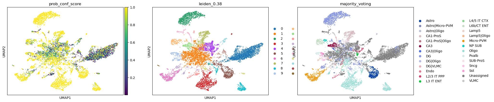
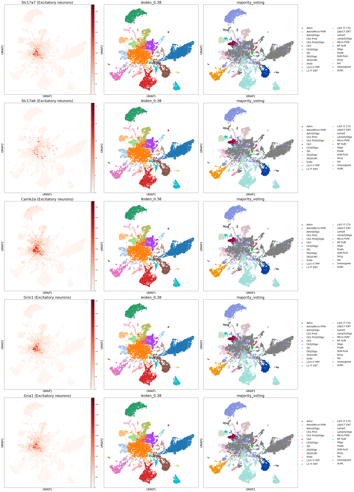
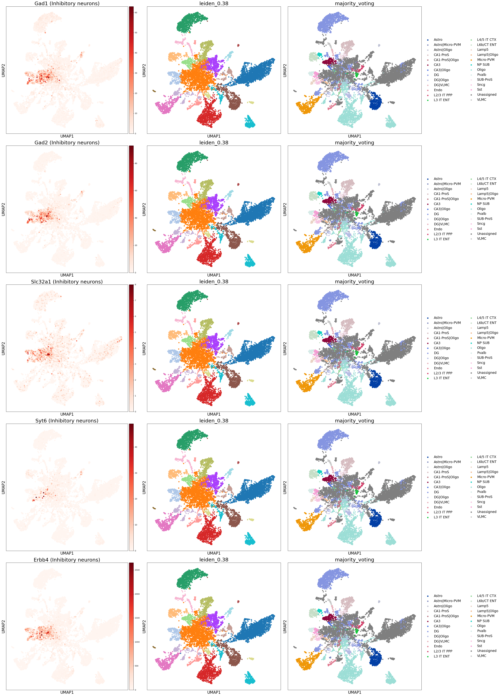
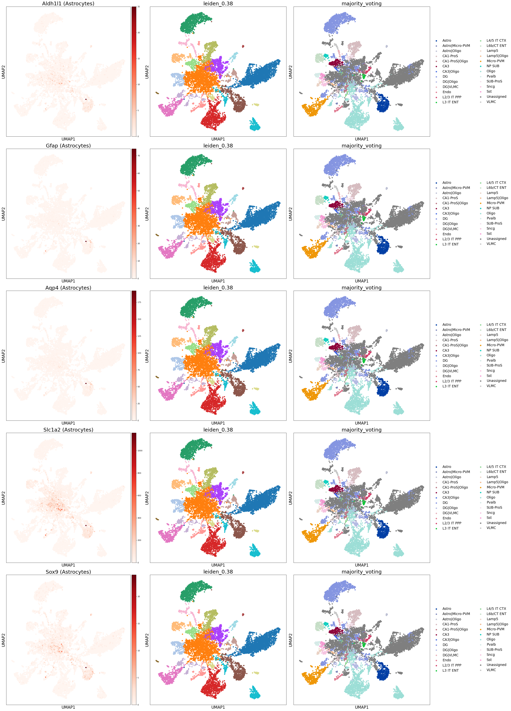
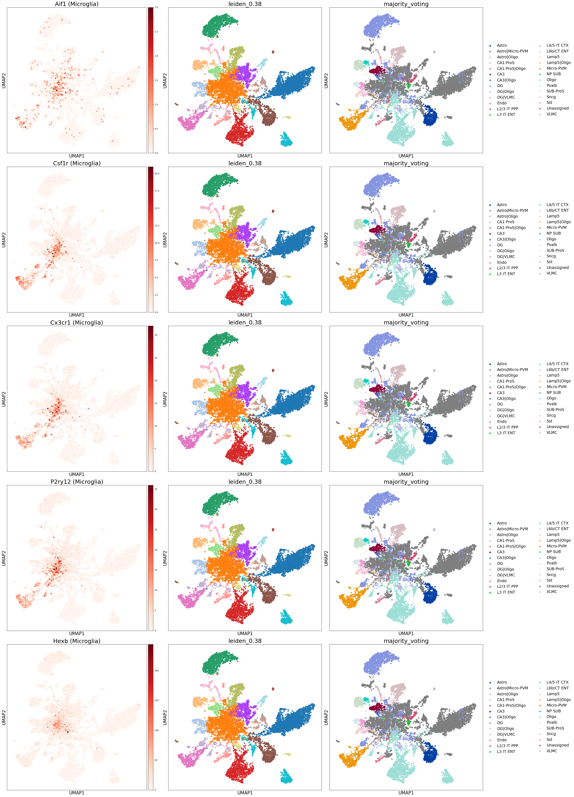
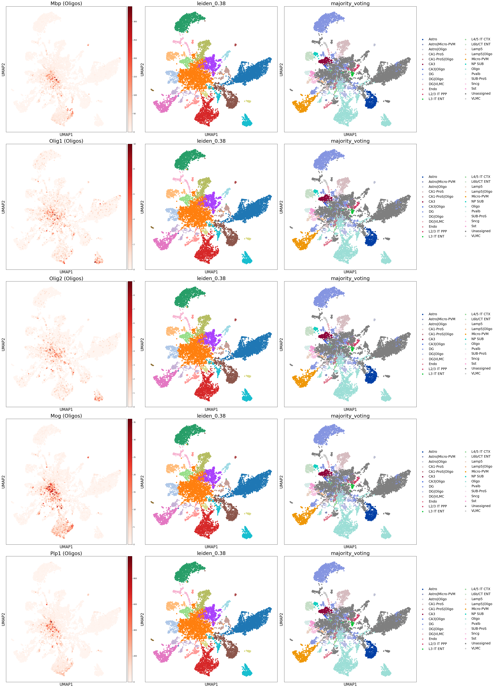
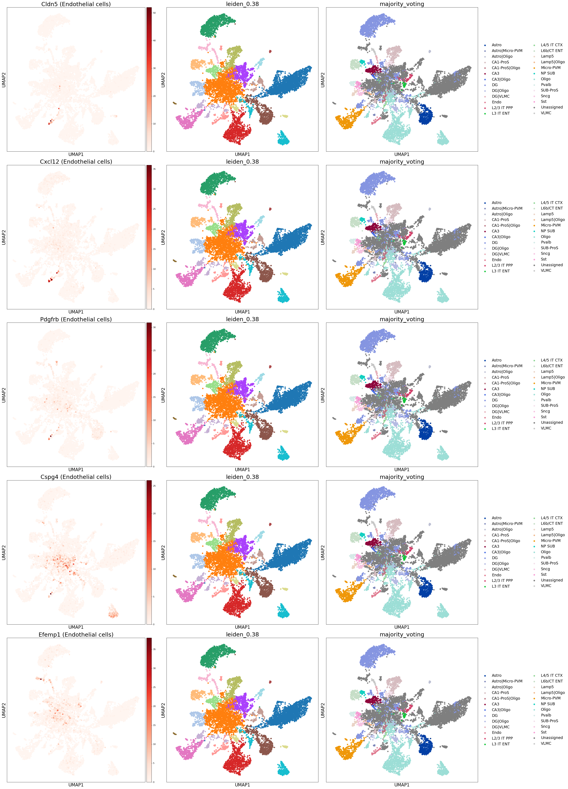
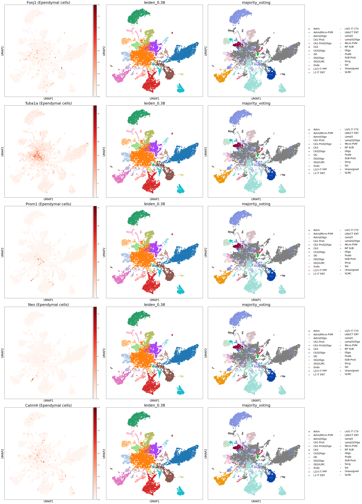
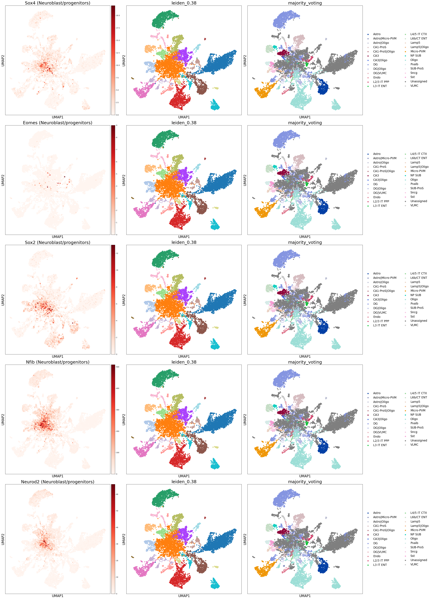

```python
import scanpy as sc
import numpy as np
import pandas as pd
import matplotlib.pyplot as plt
import os
import sys
import anndata as ad
import requests
import urllib.request
import warnings

WORKING_DIR = "/beegfs/scratch/ric.broccoli/kubacki.michal/SRF_Linda_RNA/post_analysis/check_markers"
os.chdir(WORKING_DIR)
sys.path.append(WORKING_DIR)

from functions import *

# %% [markdown]
# # Define gene sets
```


```python
gene_list = pd.read_csv("FirstLevelGeneList.csv")
gene_list


# %% [markdown]
# # Load data
```


<div>
<style scoped>
    .dataframe tbody tr th:only-of-type {
        vertical-align: middle;
    }

    .dataframe tbody tr th {
        vertical-align: top;
    }

    .dataframe thead th {
        text-align: right;
    }
</style>
<table border="1" class="dataframe">
  <thead>
    <tr style="text-align: right;">
      <th></th>
      <th>Excitatory neurons</th>
      <th>Inhibitory neurons</th>
      <th>Astrocytes</th>
      <th>Microglia</th>
      <th>Oligos</th>
      <th>Endothelial cells</th>
      <th>Ependymal cells</th>
      <th>Neuroblast/progenitors</th>
    </tr>
  </thead>
  <tbody>
    <tr>
      <th>0</th>
      <td>Slc17a7</td>
      <td>Gad1</td>
      <td>Aldh1l1</td>
      <td>Aif1</td>
      <td>Mbp</td>
      <td>Cldn5</td>
      <td>Foxj1</td>
      <td>Sox4</td>
    </tr>
    <tr>
      <th>1</th>
      <td>Slc17a6</td>
      <td>Gad2</td>
      <td>Gfap</td>
      <td>Csf1r</td>
      <td>Olig1</td>
      <td>Cxcl12</td>
      <td>Tuba1a</td>
      <td>Eomes</td>
    </tr>
    <tr>
      <th>2</th>
      <td>Camk2a</td>
      <td>Slc32a1</td>
      <td>Aqp4</td>
      <td>Cx3cr1</td>
      <td>Olig2</td>
      <td>Pdgfrb</td>
      <td>Prom1</td>
      <td>Sox2</td>
    </tr>
    <tr>
      <th>3</th>
      <td>Grin1</td>
      <td>Syt6</td>
      <td>Slc1a2</td>
      <td>P2ry12</td>
      <td>Mog</td>
      <td>Cspg4</td>
      <td>Nes</td>
      <td>Nfib</td>
    </tr>
    <tr>
      <th>4</th>
      <td>Gria1</td>
      <td>Erbb4</td>
      <td>Sox9</td>
      <td>Hexb</td>
      <td>Plp1</td>
      <td>Efemp1</td>
      <td>Calml4</td>
      <td>Neurod2</td>
    </tr>
  </tbody>
</table>
</div>


```python
# DATA dirs

# This cell will be parameterized by the script
SAMPLE_NAME = "Nestin_Ctrl"  # This will be replaced with the actual sample name
# SAMPLE_NAME = "Emx1_Ctrl"
print(f"Processing sample: {SAMPLE_NAME}")

# This cell will be parameterized by the script
Mouse_Isocortex_Hippocampus = "Mouse_Isocortex_Hippocampus"  # This will be replaced with the actual model type
# Mouse_Isocortex_Hippocampus = "Dentate_Gyrus"
print(f"Processing model: {Mouse_Isocortex_Hippocampus}")
```

    Processing sample: Nestin_Ctrl
    Processing model: Mouse_Isocortex_Hippocampus


```python
data_path = f"/beegfs/scratch/ric.broccoli/kubacki.michal/SRF_Linda_RNA/post_analysis/cell_typist/results_{Mouse_Isocortex_Hippocampus}"

adata_paths = {
    "Emx1_Ctrl": f"{data_path}/Emx1_Ctrl_annotated.h5ad",
    "Emx1_Mut": f"{data_path}/Emx1_Mut_annotated.h5ad",
    "Nestin_Ctrl": f"{data_path}/Nestin_Ctrl_annotated.h5ad",
    "Nestin_Mut": f"{data_path}/Nestin_Mut_annotated.h5ad"
}

# Load AnnData objects into a dictionary
# adata_dict = {}
# for key, path in adata_paths.items():
#     print(f"Loading AnnData from {path}")
#     adata_dict[key] = sc.read_h5ad(path)
#     print(f"AnnData object {key} contains {adata_dict[key].n_obs} cells and {adata_dict[key].n_vars} genes")
```


```python
adata = sc.read_h5ad(adata_paths[SAMPLE_NAME])
```


```python
adata

# %% [markdown]
# # Check Biomarkers
```


    AnnData object with n_obs × n_vars = 9512 × 27564
        obs: 'n_genes', 'n_genes_by_counts', 'total_counts', 'total_counts_mt', 'pct_counts_mt', 'leiden_0.05', 'leiden_0.13', 'leiden_0.22', 'leiden_0.3', 'leiden_0.38', 'leiden_0.47', 'leiden_0.55', 'leiden_0.63', 'leiden_0.72', 'leiden_0.8', 'predicted_labels', 'over_clustering', 'majority_voting', 'conf_score', 'prob_predicted_labels', 'prob_over_clustering', 'prob_majority_voting', 'prob_conf_score', 'prob_Astro', 'prob_CA1-ProS', 'prob_CA2-IG-FC', 'prob_CA3', 'prob_CR', 'prob_CT SUB', 'prob_Car3', 'prob_DG', 'prob_Endo', 'prob_L2 IT ENTl', 'prob_L2 IT ENTm', 'prob_L2/3 IT CTX', 'prob_L2/3 IT ENTl', 'prob_L2/3 IT PPP', 'prob_L2/3 IT RHP', 'prob_L3 IT ENT', 'prob_L4 RSP-ACA', 'prob_L4/5 IT CTX', 'prob_L5 IT CTX', 'prob_L5 PPP', 'prob_L5 PT CTX', 'prob_L5/6 IT TPE-ENT', 'prob_L5/6 NP CTX', 'prob_L6 CT CTX', 'prob_L6 IT CTX', 'prob_L6 IT ENTl', 'prob_L6b CTX', 'prob_L6b/CT ENT', 'prob_Lamp5', 'prob_Meis2', 'prob_Micro-PVM', 'prob_NP PPP', 'prob_NP SUB', 'prob_Oligo', 'prob_Pvalb', 'prob_SMC-Peri', 'prob_SUB-ProS', 'prob_Sncg', 'prob_Sst', 'prob_Sst Chodl', 'prob_VLMC', 'prob_Vip'
        var: 'gene_ids', 'feature_types', 'n_cells', 'mt', 'n_cells_by_counts', 'mean_counts', 'pct_dropout_by_counts', 'total_counts', 'highly_variable', 'means', 'dispersions', 'dispersions_norm', 'mean', 'std'
        uns: 'dendrogram_leiden_0.05', 'dendrogram_leiden_0.13', 'dendrogram_leiden_0.22', 'dendrogram_leiden_0.3', 'dendrogram_leiden_0.38', 'dendrogram_leiden_0.47', 'dendrogram_leiden_0.55', 'dendrogram_leiden_0.63', 'dendrogram_leiden_0.72', 'dendrogram_leiden_0.8', 'hvg', 'leiden_0.05', 'leiden_0.05_colors', 'leiden_0.13', 'leiden_0.13_colors', 'leiden_0.22', 'leiden_0.22_colors', 'leiden_0.3', 'leiden_0.38', 'leiden_0.38_colors', 'leiden_0.3_colors', 'leiden_0.47', 'leiden_0.47_colors', 'leiden_0.55', 'leiden_0.55_colors', 'leiden_0.63', 'leiden_0.63_colors', 'leiden_0.72', 'leiden_0.72_colors', 'leiden_0.8', 'leiden_0.8_colors', 'log1p', 'majority_voting_colors', 'neighbors', 'over_clustering', 'pca', 'rank_genes_0.05', 'rank_genes_0.13', 'rank_genes_0.22', 'rank_genes_0.3', 'rank_genes_0.38', 'rank_genes_0.47', 'rank_genes_0.55', 'rank_genes_0.63', 'rank_genes_0.72', 'rank_genes_0.8', 'umap'
        obsm: 'X_pca', 'X_umap'
        varm: 'PCs'
        layers: 'for_cell_typist'
        obsp: 'connectivities', 'distances'


```python
with pd.option_context("display.max_columns", None):
    adata.obs.head()
```


```python
sc.pl.umap(adata, color = ['prob_conf_score', 'leiden_0.38', 'majority_voting'], legend_loc = 'right margin')
```


    

    


```python
cell_types = gene_list.columns.tolist()
print(cell_types)
```

    ['Excitatory neurons', 'Inhibitory neurons', 'Astrocytes', 'Microglia', 'Oligos', 'Endothelial cells', 'Ependymal cells', 'Neuroblast/progenitors']


```python
markers_dict = {col: gene_list[col].dropna().tolist() for col in gene_list.columns}
markers_dict
```


    {'Excitatory neurons': ['Slc17a7', 'Slc17a6', 'Camk2a', 'Grin1', 'Gria1'],
     'Inhibitory neurons': ['Gad1', 'Gad2', 'Slc32a1', 'Syt6', 'Erbb4'],
     'Astrocytes': ['Aldh1l1', 'Gfap', 'Aqp4', 'Slc1a2', 'Sox9'],
     'Microglia': ['Aif1', 'Csf1r', 'Cx3cr1', 'P2ry12', 'Hexb'],
     'Oligos': ['Mbp', 'Olig1', 'Olig2', 'Mog', 'Plp1'],
     'Endothelial cells': ['Cldn5', 'Cxcl12', 'Pdgfrb', 'Cspg4', 'Efemp1'],
     'Ependymal cells': ['Foxj1', 'Tuba1a', 'Prom1', 'Nes', 'Calml4'],
     'Neuroblast/progenitors': ['Sox4', 'Eomes', 'Sox2', 'Nfib', 'Neurod2']}


```python
for selected_cell_type in markers_dict.keys():
    print(selected_cell_type)
    plot_marker_genes(adata, selected_cell_type, markers_dict)
```

    Excitatory neurons


    

    


    Inhibitory neurons


    

    


    Astrocytes


    

    


    Microglia


    

    


    Oligos


    

    


    Endothelial cells


    

    


    Ependymal cells


    

    


    Neuroblast/progenitors


    

    


```python


```
